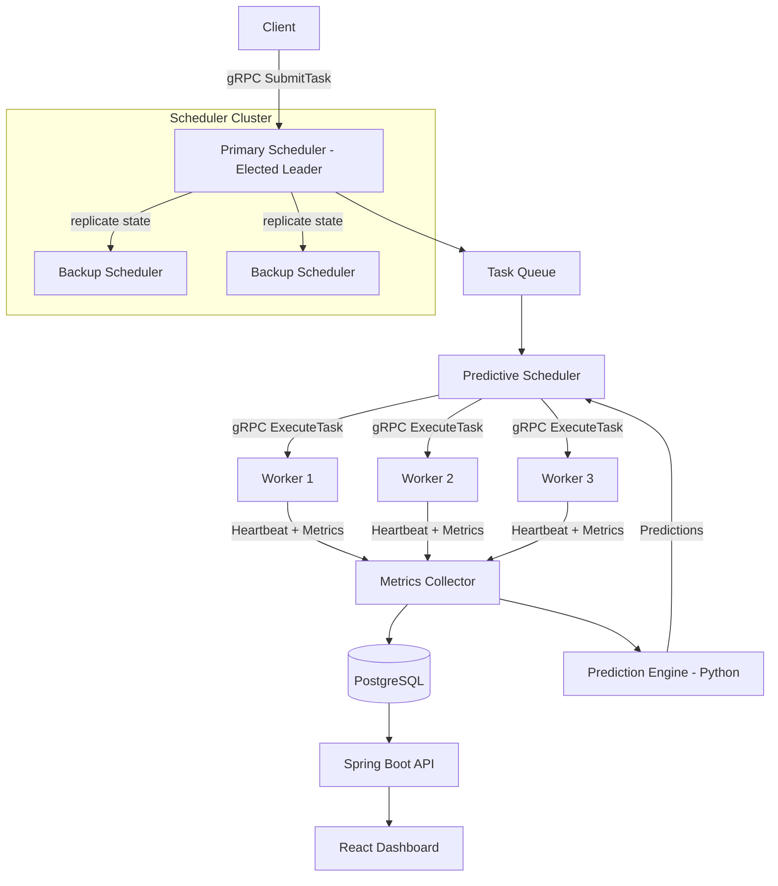

# PrediSched — Predictive Distributed Task Scheduler

PrediSched is a distributed task scheduler that **predicts** the near-future state of its cluster and
uses those predictions to place tasks, instead of only reacting to current load. Clients submit tasks
to an elected primary scheduler whose state is replicated to backups. The scheduler dispatches work to
multithreaded workers that report metrics continuously. A Python prediction service forecasts
execution time, queue growth and overload risk. The project's core question is whether predictive
placement beats Round Robin, Random, Least Loaded and Resource-Aware scheduling on latency,
throughput, balance and SLA compliance, and at what overhead. The answer has to come from controlled
benchmarks.

The product also covers ten distributed-systems topics: RPC, multithreading, clock synchronization,
leader election, replication and consistency, load balancing, MapReduce, primary-backup fault
tolerance, MPI collectives and MPI matrix multiplication. See [docs/LAB-COVERAGE.md](docs/LAB-COVERAGE.md).

> **Status:** planning complete, implementation starting. The code is built with the prompts in
> [`prompts/`](prompts/README.md). The earlier prototype (Experiments 1–3) is preserved in git history
> at commit `741a022`.

Build status: `mvn -q verify` green (Prompt 03, 2026-09-16).

## Architecture

## Stack

Java 17 · gRPC + Protocol Buffers · Maven multi-module · Python 3.10+ (pandas, scikit-learn, XGBoost) ·
Apache Spark (PySpark) · mpi4py (MS-MPI / OpenMPI) · PostgreSQL · Spring Boot 3 · React + TypeScript ·
Docker Compose.

## Documents

| Document | What it is |
| --- | --- |
| [docs/PROJECT-CONTEXT.md](docs/PROJECT-CONTEXT.md) | The full specification: requirements, contracts, design, ML, benchmarks |
| [prompts/README.md](prompts/README.md) | The build plan, 20 ordered prompts, and how to run them |
| [docs/LAB-COVERAGE.md](docs/LAB-COVERAGE.md) | Where each lab topic lives in the product, with evidence |
| [CLAUDE.md](CLAUDE.md) | Rules any coding agent follows in this repo |

## Progress

| # | Component | Done |
| --- | --- | --- |
| 00 | Foundation | ☑ |
| 01 | Task API and execution | ☑ |
| 02 | Concurrent workers and membership | ☑ |
| 03 | Scheduling strategies | ☑ |
| 04 | Time and event ordering | ☐ |
| 05 | Scheduler leadership | ☐ |
| 06 | Replicated task state | ☐ |
| 07 | Fault tolerance and failover | ☐ |
| 08 | Persistence and telemetry | ☐ |
| 09 | Parallel compute (MPI) | ☐ |
| 10 | Workload generator | ☐ |
| 11 | Log analytics (Spark) | ☐ |
| 12 | ML models | ☐ |
| 13 | Prediction service | ☐ |
| 14 | Predictive scheduler | ☐ |
| 15 | Benchmark harness | ☐ |
| 16 | Dashboard API | ☐ |
| 17 | Dashboard UI | ☐ |
| 18 | Deployment | ☐ |
| 19 | Hardening and release | ☐ |

## Prerequisites

JDK 17+, Maven 3.9, Git, Python 3.10+, Node.js 20, Docker Desktop, PostgreSQL (or its container),
MS-MPI (Windows) or OpenMPI (Linux), and PySpark (on Windows, run Spark in WSL or Docker if native setup
gives trouble). One laptop with 16 GB RAM and 4+ cores is enough; nodes run as separate processes or
containers.
