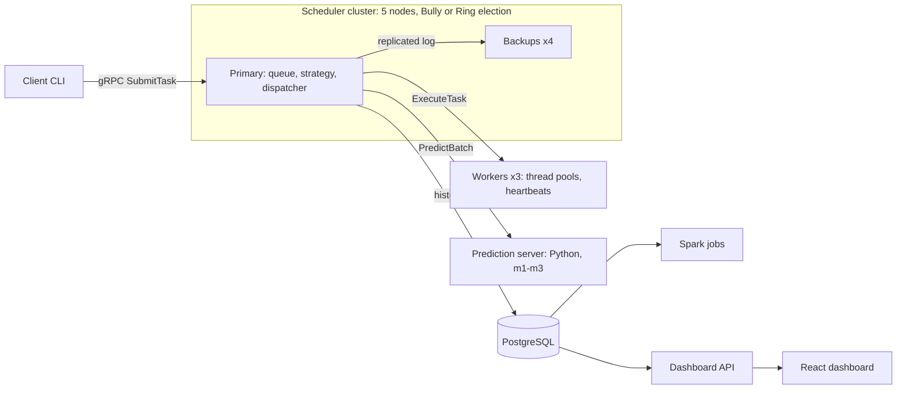

# PrediSched

PrediSched is a distributed task scheduler that evolves, experiment by experiment, from simple gRPC task submission into a fault-tolerant, ML-assisted system. Clients submit tasks to an elected primary scheduler (with its state replicated to backups), which dispatches them to multithreaded workers that continuously report metrics. A Python prediction engine forecasts execution time, queue growth, and overload risk, and the predictive scheduler uses those forecasts to place tasks proactively. The project's core contribution is a rigorous benchmark showing whether, and by how much, predictive scheduling outperforms conventional reactive strategies.

## Architecture


```mermaid
flowchart LR
    C[Client CLI] -->|gRPC SubmitTask| P
    subgraph S[Scheduler cluster: 5 nodes, Bully or Ring election]
        P[Primary: queue, strategy, dispatcher]
        B[Backups x4]
        P -->|replicated log| B
    end
    P -->|ExecuteTask| W[Workers x3: thread pools, heartbeats]
    P -->|PredictBatch| M[Prediction server: Python, m1-m3]
    P -->|history| DB[(PostgreSQL)]
    DB --> SP[Spark jobs]
    DB --> API[Dashboard API] --> UI[React dashboard]
```

Java 17 and gRPC for the cluster, Python for the models, Spark and MPI, Spring Boot and React for
the dashboard. The design, the results of every experiment and the limitations are written up in
**[docs/REPORT.md](docs/REPORT.md)**. [docs/LAB-COVERAGE.md](docs/LAB-COVERAGE.md) maps the ten
lab topics to their code.

## Quick start

**Docker** (the whole stack: 5 schedulers, 3 heterogeneous workers, PostgreSQL, the prediction
server, the dashboard API and the dashboard):

```bash
docker compose -f docker/docker-compose.yml up --build -d --wait
```
```bash
scripts/demo.sh
```

The demo walks through the ten lab topics on the running system; it pauses after each step. Then
open the dashboard at http://localhost:5173 (API docs at http://localhost:8080/swagger-ui).

**Native** (Java 17, Maven 3.9, Python 3.10+ with `pip install -r ml/requirements.txt`, and
PostgreSQL 16 on 5432):

```bash
mvn -q verify
```
```bash
CLOCK_OFFSETS="-300 500 200" CONFIG=configs/dashboard.yaml scripts/start-cluster.sh
```
```bash
cd ml && python -m predisched_ml.prediction_server --port 50070
```
```bash
java -jar predisched-dashboard-api/target/predisched-dashboard-api.jar --dashboard.cluster-config=configs/dashboard.yaml
```
```bash
scripts/demo.sh
```

On Windows use `scripts/start-cluster.ps1` and `scripts/demo.ps1`, and see
[docs/TROUBLESHOOTING.md](docs/TROUBLESHOOTING.md) for ports, MPI, Spark and Docker memory. The
full deployment notes are in [docs/components/deployment.md](docs/components/deployment.md).

## Results

Benchmark suite **`s20-20260927`** (prompt 20; method, full tables and the simulator in
[docs/components/benchmark.md](docs/components/benchmark.md), charts in
[results/benchmark/s20-20260927/report.html](results/benchmark/s20-20260927/report.html)):

- **Setup**: 5 strategies × 5 scenarios × 5 repetitions, 125 runs. Each run is a fresh cluster (one
  scheduler, three workers) on one 4-core laptop, replaying identical saved traces the models never
  saw. All 30,000 tasks completed.
- **Comparison**: predictive against the best reactive baseline in each scenario, two-sided Welch
  t-test.

| Scenario | Best baseline (mean latency) | Predictive | Difference | p |
| --- | --- | --- | --- | --- |
| steady (homogeneous workers) | round robin 343 ms | 368 ms | +7.4 % | 0.712 (no significant difference) |
| bursty | resource-aware 87 ms | 98 ms | **+12.9 % (worse)** | 0.012 |
| heterogeneous workers | resource-aware 171 ms | 167 ms | −2.2 % | 0.694 (no significant difference) |
| mixed long-tail tasks, heterogeneous workers | random 2,225 ms | 1,121 ms | **−49.6 % (better)** | < 0.001 |
| worker failure mid-run | resource-aware 160 ms | 207 ms | +29.5 % | 0.270 (no significant difference) |

**Where predictive wins.** Task sizes vary widely on uneven workers ("mixed"). Predicting each
task's execution time on each worker roughly halves the mean latency, cuts p95 by 25 % and cuts
SLA violations from 58 % to 18 %.

**Where it doesn't.** In the other scenarios it is statistically tied with the best reactive
strategy, or worse on bursty traffic of short tasks. There, its 7.7 ms prediction call per decision
(against about 0.1 ms for the reactive strategies) is a real cost.

## Documentation

- [docs/REPORT.md](docs/REPORT.md): the project report (problem, design, results, limitations,
  future work).
- [docs/LAB-COVERAGE.md](docs/LAB-COVERAGE.md): the ten lab topics, their code, demo commands and
  measured results.
- [docs/TROUBLESHOOTING.md](docs/TROUBLESHOOTING.md): Windows ports, MPI, Spark, Docker memory.
- [docs/components/](docs/components/README.md): one document per component:
  [task API](docs/components/task-api.md), [workers](docs/components/worker.md),
  [clocks](docs/components/clocks.md), [queue](docs/components/queue.md),
  [task catalogue and workloads](docs/components/tasks-and-workloads.md),
  [election](docs/components/election.md), [replication](docs/components/replication.md),
  [strategies](docs/components/strategies.md), [workflows](docs/components/workflows.md),
  [auth](docs/components/auth.md), [fault tolerance](docs/components/fault-tolerance.md),
  [storage](docs/components/storage.md), [Spark](docs/components/spark.md),
  [MPI](docs/components/mpi.md), [dataset](docs/components/dataset.md),
  [ML models](docs/components/ml-models.md),
  [prediction server](docs/components/prediction-server.md),
  [predictive strategy](docs/components/predictive-strategy.md),
  [speculation and chaos](docs/components/speculation-and-chaos.md),
  [benchmark](docs/components/benchmark.md),
  [model lifecycle](docs/components/model-lifecycle.md),
  [auto-scaling](docs/components/autoscaling.md),
  [dashboard API](docs/components/dashboard-api.md), [dashboard](docs/components/dashboard.md),
  [deployment](docs/components/deployment.md).
- `spec/PROJECT-CONTEXT.md` (the specification) and `spec/prompts/` (the numbered build prompts).

## Progress

| # | Prompt | Status |
| --- | --- | --- |
| 00 | Bootstrap | [x] |
| 01 | Task API over gRPC | [x] |
| 02 | Workers and thread pools | [x] |
| 03 | Clocks and tracing | [x] |
| 04 | Queue discipline | [x] |
| 05 | Task catalogue and workload generator | [x] |
| 06 | Leader election | [x] |
| 07 | Replication and consistency | [x] |
| 08 | Load-balancing strategies | [x] |
| 09 | Workflows and client auth | [x] |
| 10 | Primary-backup fault tolerance | [x] |
| 11 | PostgreSQL persistence and result cache | [x] |
| 12 | Spark MapReduce | [x] |
| 13 | MPI collectives | [x] |
| 14 | MPI matrix multiplication | [x] |
| 15 | Dataset collection | [x] |
| 16 | ML models | [x] |
| 17 | Prediction server | [x] |
| 18 | Predictive strategy | [x] |
| 19 | Speculative execution and chaos | [x] |
| 20 | Benchmark harness and report | [x] |
| 21 | Model lifecycle and auto-scaling | [x] |
| 22 | Dashboard API | [x] |
| 23 | Dashboard UI | [x] |
| 24 | Deployment and final report | [x] |
