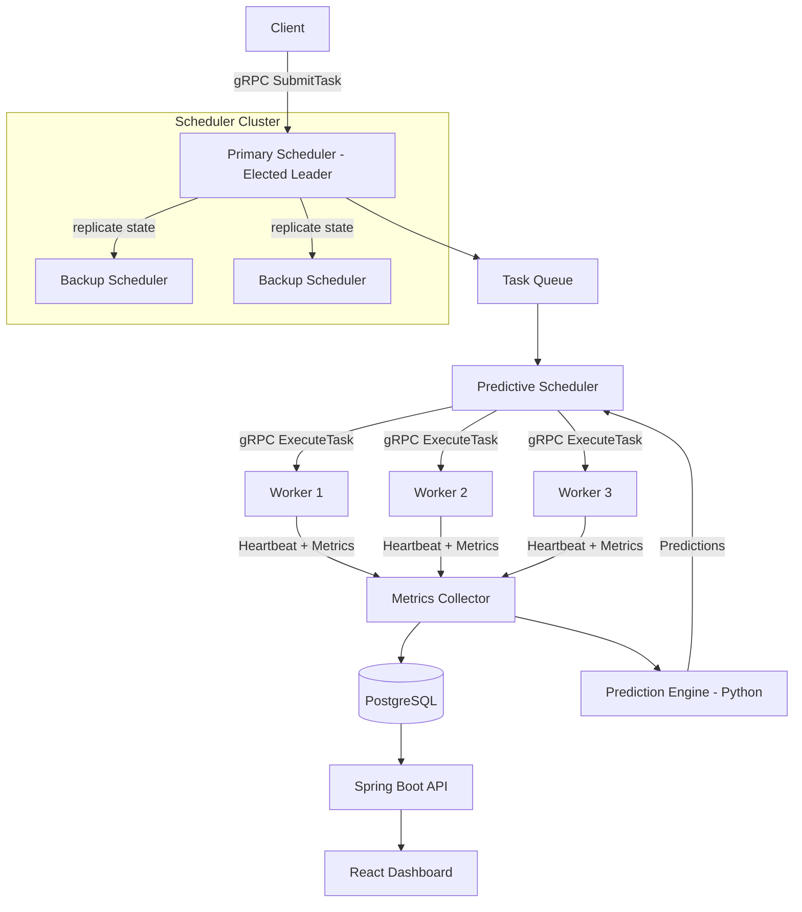
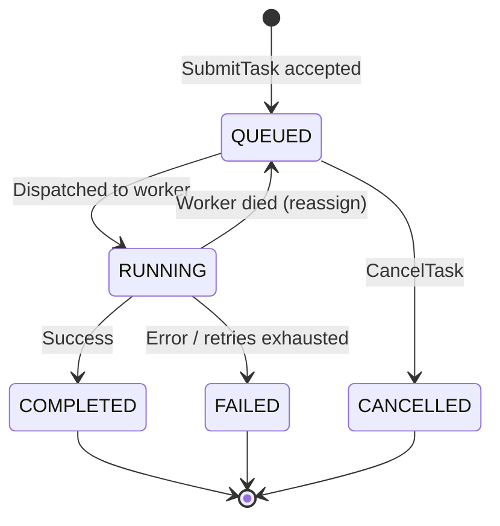
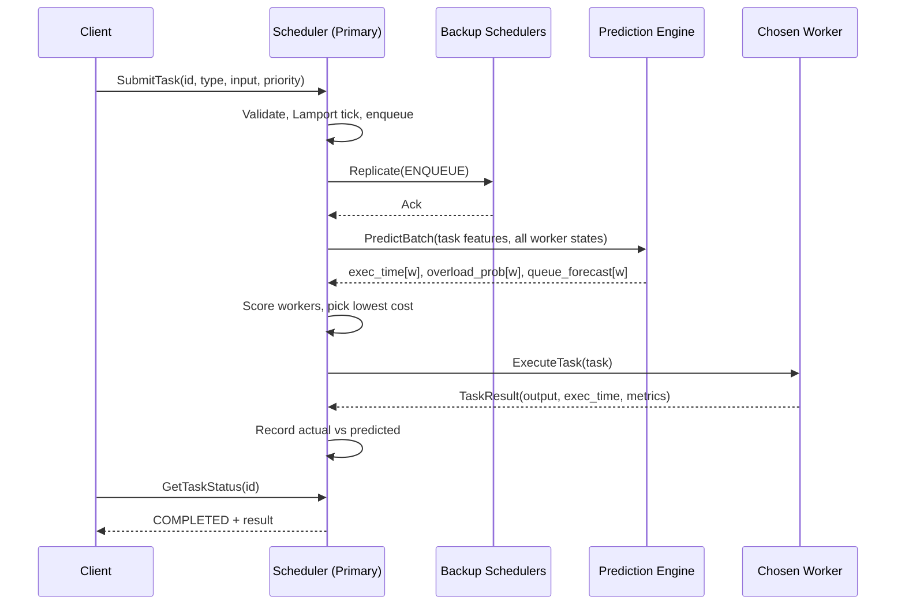

# PrediSched: Predictive Distributed Task Scheduler

**Complete Project Context Document**

---

## 1. Project Overview

PrediSched is a distributed task scheduling system that **predicts** the near-future state of a cluster and uses those predictions to allocate tasks, instead of only reacting to the current state.

A client submits computational tasks. A scheduler (the elected coordinator of a scheduler cluster) queues them and places each task on one of several worker nodes. Workers run tasks concurrently and continuously report metrics. A prediction engine uses current and historical metrics to forecast:

- how long a task will take on each worker,
- how the queue will grow,
- whether a worker is about to become overloaded.

The predictive scheduler then picks the worker expected to finish the task soonest with the least risk.

### 1.1 Core idea

| Reactive scheduling (conventional) | Predictive scheduling (PrediSched) |
|---|---|
| Task arrives → check current load → choose worker | Task arrives → current metrics + history → ML forecast → choose worker |
| Decisions based on "now" | Decisions based on "now + next few seconds" |
| Handles spikes after they happen | Anticipates spikes and spreads load early |
| Treats tasks as equal-cost | Estimates each task's cost per worker |

### 1.2 Research question

> Can predictions of workload and task execution time improve distributed task scheduling (latency, throughput, balance, SLA compliance) compared with reactive policies such as Round Robin, Least Loaded, and Resource-Aware scheduling, and at what overhead?

The answer must come from controlled benchmarks. Improvement is measured, never assumed.

### 1.3 Project philosophy

The ten lab experiments are **building blocks of one system**, not ten separate programs. Every experiment adds a reusable component to the same codebase.

```
RPC → Multithreading → Clock Sync → Leader Election → Replication & Consistency
    → Load Balancing → Spark MapReduce → Primary-Backup Fault Tolerance
    → MPI Collectives → MPI Matrix Multiplication
    → ML Pipeline → Predictive Scheduler → Benchmarking → Dashboard
```

### 1.4 Lab experiment coverage

Every lab experiment maps to a real PrediSched component.

| Exp | Lab topic | PrediSched component | Technology |
|---|---|---|---|
| 1 | Client-server communication using RPC / RMI | Client ↔ Scheduler and Scheduler ↔ Worker calls | gRPC + Protocol Buffers |
| 2 | Multithreading in a distributed system | Worker thread pools executing tasks concurrently | Java `ExecutorService` |
| 3 | Clock synchronization (logical / physical) | Lamport clocks for event ordering + Berkeley sync of physical clocks (Cristian's as alternative) | Java + gRPC |
| 4 | Bully and Ring election | Electing the primary scheduler | Java + gRPC |
| 5 | Data consistency and replication models | Task state replicated across scheduler nodes; strong (quorum) vs eventual consistency | Java + gRPC |
| 6 | Load balancing | Round Robin, Random, Least Loaded, Resource-Aware (baselines for the predictive scheduler) | Java |
| 7 | MapReduce with Hadoop / Spark | MapReduce analytics over execution logs; produces ML features | Apache Spark (PySpark) |
| 8 | Fault tolerance with primary-backup replication | Primary scheduler + backups; automatic failover with no task loss | Java + gRPC |
| 9 | MPI collectives: Broadcast, Scatter, Gather | Root rank broadcasts config, scatters tasks, gathers results | mpi4py |
| 10 | Parallel matrix multiplication using MPI | `MATRIX_TASK` executor and benchmark workload | mpi4py + NumPy |

---

## 2. Research Gaps Addressed

| # | Gap | PrediSched solution |
|---|---|---|
| 1 | No predictive workload awareness | Queue-length / arrival-rate forecasting model |
| 2 | No execution-time prediction | Per-task, per-worker execution-time regression model |
| 3 | Reactive worker selection | Worker scoring based on predicted future state |
| 4 | Poor handling of workload spikes | Queue-growth prediction triggers early redistribution |
| 5 | Worker heterogeneity ignored | Worker-specific features (cores, speed, history) |
| 6 | Scheduler is a single point of failure | Bully/Ring coordinator election + failover |
| 7 | Lack of rigorous comparison | Benchmark vs Round Robin, Random, Least Loaded, Resource-Aware |
| 8 | Scheduler state lost on failover | Replicated task state + primary-backup failover |

**Primary gap:** reactive vs predictive scheduling (Gaps 1–4).

---

## 3. System Architecture

### 3.1 High-level architecture



### 3.2 Components

| Component | Language | Responsibility |
|---|---|---|
| **Client** | Java | Submits tasks, queries status, runs workload generators |
| **Scheduler Node** | Java | Accepts tasks, maintains queue, participates in election, dispatches tasks; acts as primary or backup |
| **Election Module** | Java | Bully (primary) and Ring (comparison) coordinator election |
| **Clock Module** | Java | Lamport timestamps for event ordering + Berkeley / Cristian physical clock sync |
| **Replication Module** | Java | Replicates task state across scheduler nodes; strong (quorum) and eventual consistency modes |
| **Worker Node** | Java | Executes tasks with a thread pool; reports metrics and heartbeats |
| **Metrics Collector** | Java | Aggregates worker metrics, writes history to storage |
| **Scheduling Strategies** | Java | Pluggable: Round Robin, Random, Least Loaded, Resource-Aware, Predictive |
| **Prediction Engine** | Python | Trains and serves ML models over gRPC |
| **Fault Tolerance Module** | Java | Primary-backup replication, heartbeat failure detection, failover, task reassignment |
| **Spark Analytics Job** | PySpark | MapReduce over execution logs; aggregates features for ML |
| **MPI Compute Module** | Python (mpi4py) | Broadcast / Scatter / Gather collectives and parallel matrix multiplication |
| **Benchmark Harness** | Java + Python | Replays identical workloads across strategies, analyzes results |
| **Dashboard API** | Spring Boot | REST + WebSocket endpoints for UI |
| **Dashboard** | React + TypeScript | Live view of workers, tasks, predictions, metrics |

### 3.3 Task lifecycle



### 3.4 Predictive dispatch flow



---

## 4. Functional Requirements

| ID | Requirement |
|---|---|
| FR1 | Clients submit tasks via gRPC. |
| FR2 | The scheduler validates Task ID (unique, non-empty), type (supported), input (well-formed, within size limits), and priority (1–10). |
| FR3 | The system tracks task states: QUEUED, RUNNING, COMPLETED, CANCELLED, FAILED. |
| FR4 | Workers execute supported task types: CPU_TASK, MATRIX_TASK, SLEEP_TASK (plus MapReduce jobs later). |
| FR5 | Workers execute multiple tasks concurrently using configurable thread pools. |
| FR6 | Workers register with the scheduler (ID, host, port, cores, memory, thread-pool size). |
| FR7 | The scheduler collects worker metrics through periodic heartbeats. |
| FR8 | All nodes maintain Lamport logical clocks for event ordering and synchronize physical clocks using the Berkeley algorithm (Cristian's as an alternative). |
| FR9 | Scheduler nodes elect a coordinator using Bully or Ring (configurable). |
| FR10 | Scheduler task state is replicated across nodes with a selectable consistency model: strong (quorum) or eventual. |
| FR11 | The scheduler distributes tasks using a selectable strategy. |
| FR12 | The scheduler cluster uses primary-backup replication: the primary forwards every state change to backups before acknowledging; on primary failure a backup is promoted through election with no task loss. Tasks on failed workers are reassigned. |
| FR13 | The system records execution time, queue length, CPU, memory, throughput, availability, and arrival rate. |
| FR14 | The prediction engine forecasts execution time, queue growth, and overload probability. |
| FR15 | The predictive scheduler uses predictions to select workers. |
| FR16 | A benchmark harness compares all strategies under identical workloads. |
| FR17 | A dashboard shows workers, tasks, queue, utilization, leader, predictions, and benchmark results. |
| FR18 | Clients can query status and cancel queued tasks. |
| FR19 | The predictive scheduler falls back to Least Loaded if the prediction engine is unavailable or slow. |
| FR20 | A Spark job processes execution history with MapReduce to produce aggregated statistics and ML features. |
| FR21 | MPI computation supports Broadcast, Scatter, and Gather, and parallel matrix multiplication as a benchmark workload. |

## 5. Non-Functional Requirements

| Category | Requirement | Measurable target (prototype) |
|---|---|---|
| Performance | Low scheduling overhead | Scheduling decision < 20 ms (p95), including prediction call |
| Scalability | Grow with workers/tasks | Tested with 3–10 workers, 1,000+ tasks per run |
| Availability | Survive recoverable failures | New leader elected within ~5 s of leader failure |
| Reliability | No accepted task is lost | 0 lost tasks in fault-injection tests |
| Concurrency | Thread-safe shared state | No race conditions under stress tests |
| Consistency | Correct, replicated state | Invalid transitions rejected; strong mode never returns stale reads; eventual mode replicas converge |
| Clock accuracy | Synchronized physical clocks | Offsets reduced to a few ms after a Berkeley round on a LAN |
| Maintainability | Modular code | Separate Maven modules; strategy interface |
| Extensibility | Add new strategies/models easily | New strategy = one class implementing `SchedulingStrategy` |
| Observability | Logs and metrics everywhere | Structured logs with node ID + Lamport time |
| Security | Secure in production mode | TLS for gRPC optional; not required for lab demo |
| Usability | Simple to operate | CLI client + dashboard; one-command Docker startup |
| Reproducibility | Repeatable experiments | Fixed random seeds, saved workload traces, config files |
| Testability | Automated tests | Unit, integration, and benchmark suites |
| ML quality | Prediction error measured | Report MAE/RMSE/R², F1/ROC-AUC on held-out data |

---

## 6. Technology Stack

| Layer | Technology | Why |
|---|---|---|
| Language (core) | **Java 17+** | Strong concurrency (`ExecutorService`, `ConcurrentHashMap`), mature gRPC support |
| RPC | **gRPC + Protocol Buffers** | Typed contracts, generated stubs, efficient binary transport, already used in Exp 1 |
| Build | **Maven** (multi-module) | Dependency management, protobuf code generation, test lifecycle |
| Logging | **SLF4J + Logback** | Structured, configurable logging |
| Testing (Java) | **JUnit 5, Mockito** | Unit and integration tests |
| MPI | **mpi4py** with **MS-MPI** (Windows) or **OpenMPI** (Linux / Docker); MPJ Express if Java is mandatory | Experiments 9 and 10: collectives and parallel matrix multiplication |
| MapReduce | **Apache Spark (PySpark)** in local mode | Experiment 7; also aggregates ML features |
| ML | **Python 3.10+**, pandas, NumPy, scikit-learn, XGBoost, joblib, matplotlib | Standard, well-documented ML toolkit |
| Model serving | **Python gRPC server** (`grpcio`) | Same protocol as the rest of the system; Java calls it like any service |
| Storage | **PostgreSQL** | Persistent tasks, metrics history, predictions, decisions |
| DB access (Java) | JDBC / Spring Data JPA | Simple persistence |
| Event streaming (optional, late) | **Apache Kafka** | High-volume metric streams; only if scale requires it |
| Dashboard API | **Spring Boot 3** | REST + WebSocket, health checks, Actuator metrics |
| Frontend | **React + TypeScript** (Vite) with Recharts | Component-based live dashboard |
| Containers | **Docker + Docker Compose** | Run many scheduler/worker instances on one machine |
| Version control | **Git + GitHub** | Collaboration, CI |
| CI (optional) | **GitHub Actions** | Build + test on push |
| API testing | **grpcurl / Postman** | Manual RPC testing |

### 6.1 Resources required

**Software:** JDK 17+, Maven, IntelliJ IDEA or VS Code, Git, Python 3.10+, Node.js + npm, PostgreSQL, Docker Desktop, grpcurl or Postman, a modern browser, Apache Spark (`pip install pyspark`), mpi4py, and MS-MPI (Windows) or OpenMPI (Linux). If Spark gives trouble on native Windows, run it inside WSL or Docker.

**Hardware:** One laptop (8 GB RAM minimum, 16 GB recommended, 4+ cores) is enough. Nodes are simulated as separate processes on different ports or as Docker containers. For stronger results, use 2–3 machines on the same network.

**Data:** A self-generated workload dataset (described in Section 10). No external dataset is required.

---

## 7. Repository Structure

```
predisched/
├── pom.xml                         # parent Maven POM
├── proto/                          # shared .proto contracts
│   ├── task.proto
│   ├── worker.proto
│   ├── election.proto
│   ├── replication.proto
│   ├── clock.proto
│   └── prediction.proto
├── predisched-common/              # models, Lamport + Berkeley clocks, config, utils
├── predisched-client/              # CLI client + workload generator
├── predisched-scheduler/           # scheduler node, queue, strategies
│   └── strategy/
│       ├── SchedulingStrategy.java
│       ├── RoundRobinStrategy.java
│       ├── RandomStrategy.java
│       ├── LeastLoadedStrategy.java
│       ├── ResourceAwareStrategy.java
│       └── PredictiveStrategy.java
├── predisched-worker/              # worker node, executors, metrics reporter
├── predisched-election/            # Bully + Ring implementations
├── predisched-replication/         # replication + consistency models (Exp 5)
├── predisched-fault/               # primary-backup, heartbeats, failover (Exp 8)
├── spark/                          # PySpark MapReduce jobs (Exp 7)
├── mpi/                            # mpi4py collectives + matrix multiplication (Exp 9, 10)
├── predisched-benchmark/           # benchmark harness
├── predisched-dashboard-api/       # Spring Boot
├── ml/                             # Python
│   ├── data/                       # generated CSVs
│   ├── notebooks/                  # exploration
│   ├── features.py
│   ├── train.py
│   ├── evaluate.py
│   ├── models/                     # saved .joblib models
│   └── prediction_server.py        # gRPC PredictionService
├── dashboard/                      # React + TypeScript
├── docker/
│   └── docker-compose.yml
├── configs/                        # cluster + benchmark configs (YAML)
├── scripts/                        # start-cluster, run-benchmark
└── docs/                           # experiment reports, diagrams
```

---

## 8. Service Contracts (Protocol Buffers)

### 8.1 Client ↔ Scheduler

```protobuf
syntax = "proto3";
package predisched;

enum TaskType   { CPU_TASK = 0; MATRIX_TASK = 1; SLEEP_TASK = 2; MAPREDUCE_TASK = 3; }
enum TaskStatus { QUEUED = 0; RUNNING = 1; COMPLETED = 2; CANCELLED = 3; FAILED = 4; }

message TaskRequest {
  string task_id = 1;
  TaskType type = 2;
  string input = 3;       // e.g. "100000", "matrix size 200", "1500 ms"
  int32 priority = 4;     // 1 (low) to 10 (high)
  int64 lamport_time = 5;
}

message TaskResponse {
  string task_id = 1;
  bool accepted = 2;
  string message = 3;
  int64 lamport_time = 4;
}

message TaskStatusRequest  { string task_id = 1; }
message TaskStatusResponse {
  string task_id = 1;
  TaskStatus status = 2;
  string result = 3;
  string worker_id = 4;
  int64 exec_time_ms = 5;
}

service SchedulerService {
  rpc SubmitTask   (TaskRequest)       returns (TaskResponse);
  rpc GetTaskStatus(TaskStatusRequest) returns (TaskStatusResponse);
  rpc CancelTask   (TaskStatusRequest) returns (TaskResponse);
}
```

### 8.2 Scheduler ↔ Worker

```protobuf
message RegisterRequest {
  string worker_id = 1; string host = 2; int32 port = 3;
  int32 cores = 4; int64 memory_mb = 5; int32 pool_size = 6;
}
message Heartbeat {
  string worker_id = 1;
  double cpu_pct = 2; double mem_pct = 3;
  int32 active_threads = 4; int32 queue_len = 5;
  int64 tasks_completed = 6; double avg_exec_ms = 7;
  int64 lamport_time = 8;
}
message Ack { bool ok = 1; string message = 2; }

message ExecuteRequest { TaskRequest task = 1; }
message ExecuteResult  {
  string task_id = 1; bool success = 2; string output = 3;
  int64 exec_time_ms = 4; int64 wait_time_ms = 5; int64 lamport_time = 6;
}

service WorkerService {
  rpc ExecuteTask(ExecuteRequest) returns (ExecuteResult);
}
service RegistryService {
  rpc Register     (RegisterRequest) returns (Ack);
  rpc SendHeartbeat(Heartbeat)       returns (Ack);
}
```

### 8.3 Election

```protobuf
message ElectionMsg    { int32 sender_id = 1; repeated int32 ring_ids = 2; }
message CoordinatorMsg { int32 leader_id = 1; }

service ElectionService {
  rpc Election   (ElectionMsg)    returns (Ack);   // Bully: "OK" reply
  rpc RingPass   (ElectionMsg)    returns (Ack);   // Ring: forward ID list
  rpc Coordinator(CoordinatorMsg) returns (Ack);
  rpc Ping       (Ack)            returns (Ack);   // leader liveness
}
```

### 8.4 Scheduler ↔ Prediction Engine

```protobuf
message WorkerState {
  string worker_id = 1; int32 cores = 2;
  double cpu_pct = 3; double mem_pct = 4;
  int32 active_threads = 5; int32 queue_len = 6;
  double avg_exec_ms = 7; double arrival_rate = 8;
}
message PredictRequest  { TaskRequest task = 1; repeated WorkerState workers = 2; }
message WorkerPrediction {
  string worker_id = 1;
  double pred_exec_ms = 2;
  double pred_queue_len = 3;     // queue length in next N seconds
  double overload_prob = 4;      // 0..1
}
message PredictResponse { repeated WorkerPrediction predictions = 1; int32 model_version = 2; }

service PredictionService {
  rpc Predict(PredictRequest) returns (PredictResponse);
}
```

---

### 8.5 Replication (Exp 5 and Exp 8)

```protobuf
message ReplicateRequest {
  int64 seq_no = 1;
  string op = 2;            // ENQUEUE, UPDATE_STATUS, CANCEL
  string task_id = 3;
  bytes payload = 4;        // serialized task record
  int64 version = 5;
  int64 lamport_time = 6;
}
message ReadRequest  { string task_id = 1; }
message ReadResponse { string task_id = 1; bytes payload = 2; int64 version = 3; }
message SyncRequest  { int64 from_seq = 1; }

service ReplicationService {
  rpc Replicate(ReplicateRequest) returns (Ack);
  rpc Read     (ReadRequest)      returns (ReadResponse);
  rpc SyncFrom (SyncRequest)      returns (stream ReplicateRequest); // catch-up for new/recovered backups
}
```

### 8.6 Clock synchronization (Exp 3)

```protobuf
message TimeRequest  { int64 requester_time_ms = 1; }
message TimeResponse { int64 node_time_ms = 1; }
message ClockAdjust  { int64 offset_ms = 1; }

service ClockService {
  rpc GetTime(TimeRequest) returns (TimeResponse);  // Berkeley poll / Cristian request
  rpc Adjust (ClockAdjust) returns (Ack);           // Berkeley correction
}
```

---

## 9. Experiment-by-Experiment Implementation

### Exp 1: Client-server communication using RPC

- Define `task.proto`; generate stubs with `protobuf-maven-plugin`.
- Scheduler server validates tasks and stores them in a `ConcurrentHashMap<String, TaskRecord>`.
- Client CLI submits CPU / MATRIX / SLEEP tasks and polls status.
- gRPC is an RPC framework, so it satisfies the "RPC or Java RMI" requirement. A short RMI comparison can be added to the report.
- **Output:** submission acknowledgements, validation errors for bad inputs, final results.
- **Reused later:** all node-to-node communication.

### Exp 2: Multithreading in a distributed system

- Worker uses `ThreadPoolExecutor` with a configurable pool size and a bounded `LinkedBlockingQueue`.
- Multiple clients submit at once; the scheduler handles them concurrently.
- Thread-safe counters with `AtomicLong`; shared maps with `ConcurrentHashMap`.
- Measure throughput and latency for pool sizes 1, 2, 4, 8.
- **Output:** tasks running in parallel with thread names; speedup table.
- **Reused later:** worker execution engine.

### Exp 3: Clock synchronization (logical and physical)

- **Logical:** `LamportClock` with `tick()` before local events and sends, and `update(received)` setting `max(local, received) + 1`. Every RPC message and log line carries a Lamport timestamp.
- **Physical, Berkeley algorithm:** the leader acts as time daemon. It polls every node with `GetTime`, adjusts each reading for round-trip delay, discards outliers, computes the average, and sends each node its own `offset_ms` correction through `Adjust`.
- **Physical, Cristian's algorithm (alternative):** a worker requests the time from the scheduler and sets its clock to `server_time + RTT / 2`.
- Simulate clock drift by giving each node an artificial offset (e.g., −300 ms to +500 ms) and drift rate.
- **Output:** node offsets before and after synchronization; a Lamport-ordered event log across client, scheduler, and workers.
- **Reused later:** event ordering, last-writer-wins in replication (Exp 5), and trustworthy timestamps in the ML dataset.

### Exp 4: Bully and Ring election

- Five scheduler nodes, IDs 1–5 (ID can reflect capacity).
- **Bully:** on leader timeout, send `Election` to higher IDs; if no `OK` arrives within the timeout, declare self leader and broadcast `Coordinator`.
- **Ring:** pass an `ElectionMsg` with an accumulating ID list around the ring, skipping dead nodes; when it returns to the initiator, the highest ID becomes leader and a `Coordinator` message circulates.
- Both implement an `ElectionAlgorithm` interface. Bully is the default for PrediSched.
- **Output:** election logs; kill node 5 and node 4 is elected; comparison of message count and election time.
- **Reused later:** the elected node becomes the primary scheduler (Exp 8).

### Exp 5: Data consistency and replication models

- Three scheduler nodes each hold a `ReplicatedTaskStore` in which every record has a version number and a Lamport timestamp.
- **Strong consistency (quorum):** N = 3, W = 2, R = 2, so W + R > N. A write succeeds only after 2 replicas acknowledge; a read queries 2 replicas and returns the highest version. Reads are never stale.
- **Eventual consistency:** the write is applied locally and acknowledged immediately, then replicated asynchronously with an injected delay. Conflicts are resolved by last-writer-wins using Lamport timestamps.
- **Client-centric models (bonus):** read-your-writes and monotonic reads, by having the client remember the last version it saw.
- Demonstrations:
   1. In eventual mode, read from a lagging replica, show a stale value, then show the replicas converging.
   2. In strong mode, repeat the same read and show it is always current.
   3. Compare write latency and availability for both modes, including with one replica down.
- **Output:** consistency demo logs and a latency vs consistency table.
- **Reused later:** the replication layer underneath primary-backup (Exp 8).

### Exp 6: Load balancing

- `SchedulingStrategy` interface: `WorkerInfo select(Task task, List<WorkerInfo> workers)`.
- Implement Round Robin, Random, Least Loaded (lowest queue + active threads), and Resource-Aware (weighted CPU / memory / queue score).
- **Output:** distribution of tasks per worker, latency, and imbalance under each strategy.
- **Reused later:** the baselines for the predictive scheduler.

### Exp 7: MapReduce with Apache Spark

- Input: PrediSched execution logs (CSV) collected during Exp 2 and Exp 6. A classic word count on the event log serves as a warm-up.
- Use the Spark **RDD API** so the map and reduce phases are explicit:
   - **Map:** each log line → `(task_type, (exec_time_ms, 1))` and `(worker_id, (exec_time_ms, 1))`.
   - **Reduce:** `reduceByKey` sums times and counts.
   - **Result:** average execution time and task count per task type and per worker.
- Run with `spark-submit` in local mode (`local[*]`) and show the job stages in the Spark UI at port 4040.
- **Output:** aggregated tables and the Spark job DAG.
- **Reused later:** feature aggregation for the ML pipeline (Section 10).

### Exp 8: Fault tolerance with primary-backup replication

- The node elected in Exp 4 is the **primary**; the others are **backups**.
- Write path: client → primary → primary logs the change with a sequence number → forwards `Replicate` to backups → backups apply it in sequence order and acknowledge → primary acknowledges the client.
- Backups watch the primary through `Ping` heartbeats. On timeout, Bully elects the highest-ID backup as the new primary; it already holds the full task state and resumes dispatching.
- Clients keep a list of scheduler addresses and retry against the new primary.
- A recovered node rejoins as a backup and catches up using `SyncFrom`.
- Worker failures are also handled: after 3 missed heartbeats, RUNNING tasks return to QUEUED and are reassigned.
- **Output:** submit 100 tasks, kill the primary at task 50, and show all 100 tasks complete with none lost or duplicated.

### Exp 9: MPI collective communication

- Implemented with mpi4py and run with `mpiexec -n 4 python mpi/collectives.py`.
- Rank 0 plays the scheduler (root); the other ranks are workers.
   - **Broadcast:** rank 0 sends the scheduling configuration (task type, parameters) to all ranks with `comm.bcast`.
   - **Scatter:** rank 0 splits a batch of task inputs into chunks and sends one chunk to each rank with `comm.scatter` (and `Scatter` on NumPy arrays).
   - **Gather:** each rank executes its chunk and returns results and timings to rank 0 with `comm.gather`.
- **Output:** rank-wise logs showing what each rank received and returned, and the combined result on rank 0.

### Exp 10: Parallel matrix multiplication using MPI

- Rank 0 creates matrices A and B (n × n).
- **Scatter** the rows of A across ranks (`Scatterv` when n is not divisible by the process count).
- **Broadcast** B to all ranks.
- Each rank computes its row block of A × B locally.
- **Gather** the partial results into C on rank 0 and verify C against a sequential result.
- Measure time for n = 200, 400, 800 with 1, 2, and 4 processes; report speedup and efficiency.
- **Output:** correctness check, timing table, speedup graph.
- **Reused later:** an MPI-backed executor for `MATRIX_TASK` and a heavy benchmark workload for the predictive scheduler.

---

## 10. ML Pipeline

### 10.1 Data generation

Run controlled workloads with the non-predictive strategies and log every task execution.

| Column | Description |
|---|---|
| timestamp | Dispatch time |
| task_id, task_type | Identity and type |
| input_size | Number / matrix dimension / sleep ms |
| priority | 1–10 |
| worker_id, worker_cores | Target worker and capacity |
| cpu_pct, mem_pct | Worker utilization at dispatch |
| active_threads, queue_len | Worker load at dispatch |
| arrival_rate | Tasks/sec over the last 10 s |
| avg_exec_recent | Worker's mean exec time over recent tasks |
| wait_time_ms | Time spent queued (target) |
| exec_time_ms | Actual execution time (target) |
| queue_len_future | Worker queue length N seconds later (target) |
| overloaded_future | 1 if CPU > 85% or queue > threshold within N seconds (target) |
| status | COMPLETED / FAILED |

**Workload patterns to generate** (so the model sees variety):

- steady (constant rate),
- bursty (sudden spikes),
- periodic (sine-wave rate),
- mixed task types,
- heterogeneous workers (different pool sizes / CPU limits via Docker).

Target: at least 10,000–50,000 rows. Raw logs are cleaned and aggregated with the Spark job from Exp 7 before training.

### 10.2 Models

| Model | Type | Target | Metrics |
|---|---|---|---|
| M1: Execution time | Regression | `exec_time_ms` | MAE, RMSE, R² |
| M2: Queue forecast | Regression / time series | `queue_len_future` | MAE, RMSE |
| M3: Overload risk | Classification | `overloaded_future` | Precision, Recall, F1, ROC-AUC |

**Model progression:** naive baseline (historical mean per task type) → Linear/Logistic Regression → Random Forest → XGBoost. Keep the simplest model that clearly beats the baseline.

**Validation:** time-based train/test split (no random shuffling of time-series data), plus a held-out workload pattern to test generalization.

### 10.3 Serving

- `prediction_server.py` loads saved models with joblib and exposes `PredictionService` over gRPC.
- The scheduler calls it with a strict timeout (e.g., 10 ms). On timeout or error, it falls back to Least Loaded (FR19).
- Log every prediction next to the actual outcome for monitoring and retraining.

### 10.4 Predictive scheduling logic

For each candidate worker *w*:

```
expected_completion(w) = predicted_wait(w) + predicted_exec(task, w)
cost(w) = expected_completion(w) × (1 + λ × overload_prob(w))
```

- `predicted_wait(w)` is derived from the queue forecast and the worker's recent average execution time.
- λ (penalty weight) is tuned during benchmarking.
- Choose the worker with the lowest cost.
- High-priority tasks can use a stricter overload threshold.

**Proactive actions (stretch goals):** hold low-priority tasks when all workers show high overload risk; rebalance queued tasks when a queue spike is forecast; signal a "scale up" event when the cluster-wide forecast exceeds capacity.

---

## 11. Benchmarking Methodology

**Strategies compared:** Round Robin, Random, Least Loaded, Resource-Aware, Predictive.

**Controls:** the same saved workload trace, same worker configuration, same seed, and at least 5 repetitions per configuration. Report mean and standard deviation.

**Scenarios:**

1. Steady load
2. Bursty load
3. Heterogeneous workers
4. Mixed task types
5. Worker failure mid-run

**Metrics:**

| Metric | Meaning |
|---|---|
| Average latency | Submit → completion |
| P95 / P99 latency | Tail behaviour |
| Throughput | Tasks completed per second |
| Makespan | Time to finish the whole workload |
| CPU utilization | Mean and variance across workers |
| Worker imbalance | Std. dev. of load across workers |
| Max queue length | Spike handling |
| SLA violations | % of tasks exceeding a deadline |
| Scheduling overhead | Time spent choosing a worker |
| Prediction error | Live MAE of exec-time predictions |

**Outputs:** CSV results, comparison tables, and charts (latency CDF, throughput bars, queue-over-time lines).

---

## 12. Data Storage (PostgreSQL)

| Table | Key columns |
|---|---|
| `tasks` | task_id, type, input, priority, status, worker_id, submitted_at, started_at, completed_at, result |
| `workers` | worker_id, host, port, cores, memory_mb, pool_size, status, last_heartbeat |
| `worker_metrics` | worker_id, ts, cpu_pct, mem_pct, active_threads, queue_len |
| `execution_history` | task_id, worker_id, features…, wait_time_ms, exec_time_ms |
| `predictions` | task_id, worker_id, pred_exec_ms, overload_prob, model_version, ts |
| `scheduling_decisions` | task_id, strategy, chosen_worker, cost, decision_ms |
| `events` | node_id, lamport_time, event_type, details |
| `replication_log` | seq_no, node_id, op, task_id, version, lamport_time, applied_at |
| `clock_sync` | node_id, ts, offset_before_ms, offset_after_ms, algorithm |
| `failures` | node_id, type, detected_at, recovered_at |
| `benchmark_runs` | run_id, strategy, scenario, metrics JSON |

Early experiments (1–4) use in-memory maps only; the database is added from Exp 8 onward.

---

## 13. Dashboard

**Spring Boot endpoints:** `GET /workers`, `GET /tasks`, `GET /metrics`, `GET /predictions`, `GET /scheduler` (leader, strategy), `GET /benchmarks`, plus a WebSocket stream for live updates.

**React views:**

- **Cluster overview:** worker cards (CPU, memory, queue, status), current leader.
- **Task table:** filter by status/type, live updates.
- **Predictions:** predicted vs actual execution time, overload risk per worker.
- **Queue chart:** actual vs forecast queue length.
- **Benchmarks:** strategy comparison charts.
- **Event log:** Lamport-ordered events, elections, failures.

---

## 14. Deployment

**Local development:** run each node as a separate Java process with different ports:

```
Scheduler nodes: 50051–50055   (IDs 1–5)
Workers:         50261–50263
Prediction:      50070
Spark UI:        4040
Dashboard API:   8080
React dev:       5173
PostgreSQL:      5432
```

**Docker Compose:** one service per node, a `postgres` service, a `prediction` service, `dashboard-api`, and `dashboard`. Worker heterogeneity is simulated with `cpus:` and `mem_limit:` settings.

**Fault demos:** `docker stop scheduler-5` (the primary) to trigger election and backup promotion; `docker stop worker-2` to trigger task reassignment.

---

## 15. Testing Strategy

| Level | Examples |
|---|---|
| Unit | Lamport clock rules, task validation, each scheduling strategy, cost function |
| Concurrency | Many clients submitting simultaneously; no duplicate or lost tasks |
| Integration | Client → scheduler → worker end-to-end over gRPC |
| Election | Leader killed; exactly one new leader; simultaneous elections resolve correctly |
| Clock sync | Offsets shrink after a Berkeley round; Lamport ordering preserved across nodes |
| Replication | Strong mode never returns stale reads; eventual mode replicas converge |
| Primary-backup | Primary killed mid-run; zero lost or duplicated tasks |
| Spark / MPI | Spark aggregates match a pandas check; MPI matrix result equals sequential result |
| Fault injection | Worker killed mid-task; task completes elsewhere |
| ML | Model beats baseline on held-out data; server handles bad input |
| Benchmark | Repeatable results within acceptable variance |

---

## 16. Suggested Timeline

| Phase | Weeks | Deliverable |
|---|---|---|
| Foundation | 1–3 | Exp 1–3: RPC, thread pools, logical + physical clock sync |
| Coordination | 4–5 | Exp 4–5: Bully / Ring election, replication and consistency models |
| Distribution | 6–8 | Exp 6–8: load balancing, Spark MapReduce, primary-backup fault tolerance |
| Parallelism | 9–10 | Exp 9–10: MPI collectives, MPI matrix multiplication |
| Data | 11 | Workload generator, dataset collection, PostgreSQL |
| ML | 12–13 | Train/evaluate models, prediction server |
| Integration | 14 | Predictive strategy, fallback, logging |
| Evaluation | 15 | Full benchmark suite and analysis |
| Presentation | 16 | Dashboard, report, demo video |

---

## 17. Risks and Limitations

- ML predictions can be wrong, and a poor model can make scheduling worse than a simple baseline.
- Prediction calls add overhead to each scheduling decision.
- Historical data may not capture sudden, unseen spikes.
- New task types face a cold-start problem (mitigated by falling back to type-average estimates).
- Monitoring and heartbeats add network and CPU overhead.
- A single active coordinator can become a throughput bottleneck.
- Workload patterns drift, so models may need periodic retraining.
- Simulating a cluster on one laptop limits how realistic the results are.
- Benefits must be shown through controlled benchmarks; they cannot be claimed without them.

These limitations are part of the evaluation and future work, not something to hide.

## 18. Future Work

- Online learning / periodic automatic retraining
- Reinforcement-learning scheduler
- Auto-scaling workers on Kubernetes
- Consensus-based replication (Raft) replacing primary-backup
- Distributed mutual exclusion (Ricart–Agrawala) for shared resources
- Deadline-aware and energy-aware scheduling
- Real cluster traces (e.g., public datacenter workload traces) for validation

---

## 19. Resume Description

**PrediSched: Predictive Distributed Task Scheduler** | Java, gRPC, Python, XGBoost, Apache Spark, MPI, PostgreSQL, Spring Boot, React, Docker

- Built an ML-assisted distributed task scheduler with gRPC communication, thread-pooled workers, Lamport and Berkeley clock synchronization, Bully/Ring coordinator election, and replicated scheduler state with strong and eventual consistency modes.
- Trained execution-time, queue-forecast, and overload-risk models on self-generated workload traces and served them over gRPC with a fallback to reactive scheduling.
- Benchmarked predictive scheduling against Round Robin, Random, Least Loaded, and Resource-Aware strategies on latency, throughput, utilization, and SLA violations under steady, bursty, and failure scenarios.
- Implemented primary-backup failover and heartbeat-based task reassignment with zero lost tasks in fault-injection tests.
- Processed execution logs with Spark MapReduce for feature engineering and ran MPI-based parallel matrix multiplication as a benchmark workload.

*(Replace qualitative claims with your measured numbers once benchmarks are complete, e.g., "reduced P95 latency by X% under bursty load".)*

---

## 20. One-Paragraph Summary

PrediSched is a distributed task scheduler that evolves, experiment by experiment, from simple gRPC task submission into a fault-tolerant, ML-assisted system. Clients submit tasks to an elected primary scheduler (with its state replicated to backups), which dispatches them to multithreaded workers that continuously report metrics. A Python prediction engine forecasts execution time, queue growth, and overload risk, and the predictive scheduler uses those forecasts to place tasks proactively. The project's core contribution is a rigorous benchmark showing whether, and by how much, predictive scheduling outperforms conventional reactive strategies.
