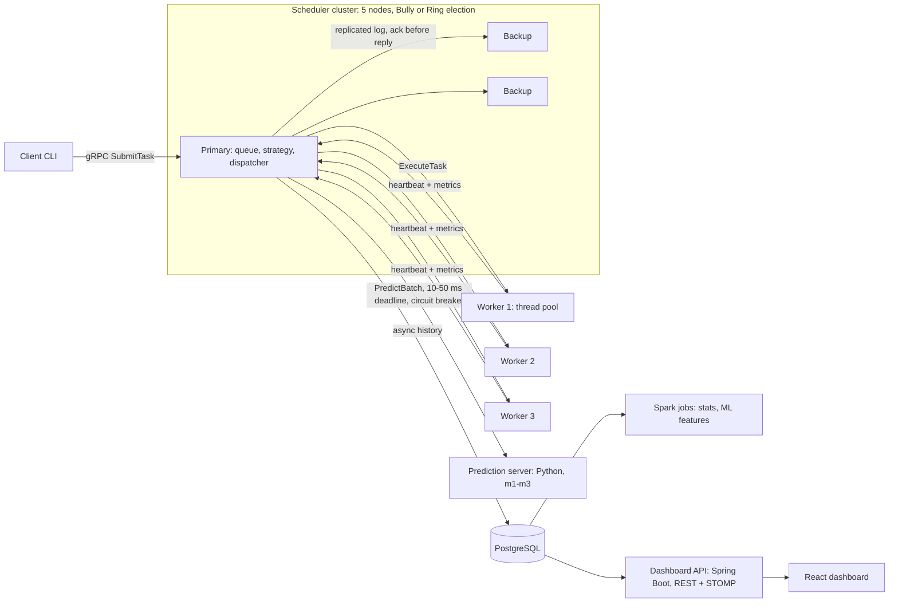

# PrediSched: project report

A predictive distributed task scheduler, built as one product across the ten distributed-systems
lab topics and then used to test one question. Every number below cites the results file or
component doc it comes from. The component docs in `docs/components/` hold the method, the raw
output and the tests behind each result.

## 1. Problem

Conventional schedulers are **reactive**. When a task arrives they look at the cluster *now*,
through a policy such as round robin, least loaded or resource-aware, and treat every task as
equal-cost. PrediSched is **predictive**. It forecasts three things and places each task where it
is expected to finish soonest at the least risk:
- how long the task will take on each worker;
- how each worker's queue will grow;
- whether a worker is about to overload.

The research question (spec §1.2):

> Can predictions of workload and task execution time improve distributed task scheduling
> (latency, throughput, balance, SLA compliance) compared with reactive policies, and at what
> overhead?

The answer had to come from controlled benchmarks, never from assumption (RULES rule 7).

## 2. Design

**The parts:**
- **Java modules** (Maven, Java 17, gRPC 1.66):
  - `common` holds the protos, clocks, config and event log;
  - `scheduler`, `worker` and `client`;
  - `election`, `replication` and `fault`;
  - `benchmark` and `dashboard-api`.
- **Python:**
  - `ml/`: dataset, models, prediction server and lifecycle;
  - `spark/`: MapReduce jobs;
  - `mpi/`: collectives and matrix multiplication.
- **Dashboard:** `dashboard/` (React and TypeScript).
- **Deployment:** `docker/`, one compose stack.

The main design choices:

- **Contracts first.** Every cross-process call is gRPC, defined in `proto/`, and Java and Python
  generate from the same files.
- **Pluggable strategies and executors.** A strategy is one `SchedulingStrategy` class chosen by
  config, and the predictive strategy is just one more. Task types are `TaskExecutor`s the same way.
- **The primary is the elected leader** (FR9, FR12).
  - It logs every state change with a sequence number and gets an ack from every live backup
    before it acknowledges the client.
  - A new leader pulls any gap, rebuilds the queue and settles in-doubt dispatches before it
    dispatches ([fault-tolerance.md](components/fault-tolerance.md)).
- **Predictions are advisory.** The predictive strategy falls back to least loaded when the server
  misses its deadline, errors or is circuit-broken, and it records why
  ([predictive-strategy.md](components/predictive-strategy.md)). Its cost function:
  `cost(w) = (pred_wait + pred_exec) × (1 + λ × overload_prob)`, with λ = 1 chosen on campaign
  traces (`results/lambda-tuning.csv`).
- **Reproducible experiments.**
  - Workloads are seeded trace files, replayed and checksummed, never regenerated
    (`workloads/benchmark/manifest.txt`).
  - Every benchmark run starts on a fresh cluster.
  - The models never see the benchmark traces: seeds 2001–2005 for the benchmark, against
    1500–1517 for the campaign.

## 3. Lab experiments

Each lab topic is a working part of the product. [LAB-COVERAGE.md](LAB-COVERAGE.md) maps each to
its code and demo command, and `scripts/demo.sh` runs all ten live
([deployment.md](components/deployment.md)).

| Exp | Topic | Result | Source |
| --- | --- | --- | --- |
| 1 | RPC | `CPU_TASK n=2000000` submitted over gRPC, dispatched and completed in 19 ms of execution; an invalid submit is rejected with every validation error listed | [task-api.md](components/task-api.md) |
| 2 | Multithreading | 40 × `CPU_TASK n=20000000` on 8 threads: pool 1 = 5.68 tasks/s, pool 4 = 8.22 (1.45×), pool 8 = 8.35 (1.47×). The laptop's 4 physical cores cap the gain | `results/exp2-pool-size.csv` |
| 3 | Clock sync | Berkeley: spread 807 → 13 → 2 ms over three rounds. Cristian: a worker 450 ms behind corrected in one round (rtt 36 ms). Lamport order fixes an event that physical order places 11 ms before its own cause | [clocks.md](components/clocks.md) |
| 4 | Election | Killing leader 5: all survivors agree on 4 in 1.7 s (Bully) or 2.5 s (Ring), dominated by failure detection; the election itself takes 5–59 ms. With one detector: Bully 20 messages, Ring 9 | `results/exp4-election.csv` |
| 5 | Consistency | 500 writes with one replica lagging 50 ms. Strong: 0 stale reads, write p50 6.3 ms (57.1 ms with a replica down). Eventual: 500/500 stale reads, p50 0.01 ms, converged in 94 ms | `results/exp5-consistency.csv` |
| 6 | Load balancing | At 20 tasks/s on pools 2/4/8, mean latency: round robin 431.9 ms, random 214.8, least loaded 174.1, resource-aware 184.1 | `results/exp6-strategies*.csv` |
| 7 | Spark MapReduce | `map` + `reduceByKey` over 633 executions equals a pandas groupby on all 13 keys; the job splits into two stages at the shuffle | [spark.md](components/spark.md) |
| 8 | Primary-backup | Primary killed after task 50 of 100: new primary elected in 1003 ms, dispatching again at 1137 ms; **100/100 completed, 0 lost, 0 duplicated**. Worker killed mid-task: the task completed elsewhere on attempt 2 | `results/exp8-failover.csv` |
| 9 | MPI collectives | 20 tasks scattered over 4 ranks and gathered; outputs identical to the Java workers'; makespan 2093 ms on 1 rank, 581–865 ms on 4 | `results/exp9-collectives.csv` |
| 10 | MPI matmul | Correct in every run (checksums equal Java's). Speedup at n = 800: 1.59× on 2 processes (80 % efficiency), 1.33× on 4, where the 4-core, 15 W laptop CPU is the limit | `results/exp10-matmul.csv`, `docs/img/exp10-speedup.png` |

## 4. The ML pipeline

- **Dataset** ([dataset.md](components/dataset.md), `ml/data/dataset-card.md`):
  - 72 campaign runs: 6 profiles × 3 patterns × 4 strategies on heterogeneous workers.
  - 11,520 executions, of which 11,318 labelled rows remain.
  - Features are leak-free, labels look ahead 5 s, and the split is by time.
- **Models** ([ml-models.md](components/ml-models.md), `ml/reports/`). Each model is kept only if
  it beats the best baseline by 10 % on cross-validation. The simplest qualifying candidate wins.
  - **M1, execution time: ridge (α = 0.1).**
    - Time-split test: MAE 28.0 ms, R² 0.85, against 92.7 ms for the mean per task type.
    - Unseen `periodic` pattern: MAE 20.9 ms, R² 0.92.
    - Unseen task type (GRAPH_TASK): R² 0.43. There the spec's cold-start rule (predict the
      type's running mean) did worse than the model left alone: MAE 60.7 against 37.2 ms.
  - **M2, queue length 5 s ahead: the baseline (mean per worker) was kept.** No candidate beat it
    by 10 %. The queue is 0 in 96 % of rows because the scheduler caps outstanding work per worker,
    so there is almost no signal.
  - **M3, overload within 5 s: logistic regression.**
    - Time-split test: F1 0.89, ROC-AUC 0.99.
    - Unseen `periodic` pattern: F1 0.24. Overload behaves differently under that pattern.
- **Serving** ([prediction-server.md](components/prediction-server.md),
  `results/prediction-latency.csv`):
  - The server answers one batch request per decision, with every worker in it.
  - Latency: client p50 3.7 ms, p95 4.3 ms, 263 requests/s.
  - With 4 concurrent callers the client p95 rises to 22.9 ms.
- **Lifecycle** ([model-lifecycle.md](components/model-lifecycle.md)):
  - **Shadow models.** A retrained v2 in shadow scored MAE 32.5 ms against 43.2 ms for live v1 over
    309 tasks (−24.7 %) and was promoted. The server hot-reloaded it.
  - **Drift detection** fired when the live MAE reached 2.01× the test MAE for 50 tasks in a row.

## 5. Benchmark findings

Suite **`s20-20260927`**. The method is in [benchmark.md](components/benchmark.md), and the data
is in `results/benchmark/s20-20260927/`: `runs.csv`, `summary.csv`, `report.html`, `report.pdf`.

- **Runs:** 5 strategies × 5 scenarios × 5 repetitions = 125 runs.
- **Setup:** each run on a fresh cluster (1 scheduler, 3 workers), replaying identical saved
  traces.
- **Completion:** all 30,000 tasks completed.
- **Test:** predictive against the best reactive baseline per scenario, with Welch's t-test.

| Scenario | Best baseline (mean latency) | Predictive | Difference | p |
| --- | --- | --- | --- | --- |
| steady, homogeneous workers | round robin 343 ms | 368 ms | +7.4 % | 0.712 (no significant difference) |
| bursty | resource-aware 87 ms | 98 ms | **+12.9 % (worse)** | 0.012 |
| heterogeneous workers | resource-aware 171 ms | 167 ms | −2.2 % | 0.694 (no significant difference) |
| mixed long-tail tasks, heterogeneous workers | random 2,225 ms | 1,121 ms | **−49.6 % (better)** | < 0.001 |
| worker failure mid-run | resource-aware 160 ms | 207 ms | +29.5 % | 0.270 (no significant difference) |

**The answer to the research question is "yes, where task costs differ, and at a measurable
price".**

- **Mixed long-tail tasks on uneven workers.** Here predicting each task's cost on each worker
  pays:
  - mean latency −49.6 %;
  - p95 −25.1 % (p = 0.002);
  - throughput +5.0 % (p = 0.007);
  - SLA violations down from 58.2 % to 18.1 % (p < 0.001).
- **Elsewhere predictive is statistically tied**, or worse on bursty traffic of short, similar
  tasks, where one wrong call is cheap and the reactive strategies are already right.
- **Overhead.** A predictive decision takes 7.7 ms mean (16.1 ms p95), against 69–92 µs for the
  reactive strategies. That is within the 20 ms budget, but about 100 times more.
- **Prediction error in the live runs.** The exec-time MAE was 22–42 ms in four scenarios and
  80 ms on the long-tail mix ([benchmark.md](components/benchmark.md)).

**Predictive auto-scaling** (suite `s21-autoscale`, `results/benchmark/s21-autoscale/`,
[autoscaling.md](components/autoscaling.md)), on a bursty load with 3 repetitions:
- Both kinds of scaling roughly halve latency against no scaling.
- Predictive scaling had −21.4 % mean latency against reactive scaling (p = 0.061).
- **That difference is not significant at 0.05 with 3 repetitions, and it is not claimed.**

## 6. Other features, measured

- **Speculative execution** ([speculation-and-chaos.md](components/speculation-and-chaos.md)).
  Stragglers are tasks past max(k × prediction, the p90 of their type). They get a copy on another
  worker, and the loser is cancelled. The test workload ends with exactly one successful attempt
  per task.
- **Chaos API.** Latency, CPU spikes, partitions, drain, crash and bursts, all available from the
  CLI and the dashboard. A crash of the primary during a replay was promoted over in 40 ms after
  the leader change.
- **Queue discipline** ([queue.md](components/queue.md)): priority ageing, retries with jittered
  exponential backoff (200 → 400 → 800 ms), a dead-letter queue and deadlines.
- **Persistence** ([storage.md](components/storage.md)): PostgreSQL history written
  asynchronously in batches, a result cache for deterministic tasks, and an SLA report per
  strategy and task type.
- **Workflows and auth** ([workflows.md](components/workflows.md), [auth.md](components/auth.md)):
  task DAGs, API keys and JWT, node credentials, and optional TLS.
- **Dashboard** ([dashboard.md](components/dashboard.md)): seven live pages, a per-decision
  explainer and chaos controls. Screenshots are in `docs/img/`.

## 7. Limitations (spec §19)

How each risk from the spec turned out:

- **Wrong predictions make scheduling worse: observed.**
  - Predictive is 12.9 % worse on bursty short tasks.
  - The overload model's F1 drops to 0.24 on an unseen arrival pattern.
  - M2 never beat its baseline.
- **Prediction overhead: measured.** 7.7 ms per decision, against under 0.1 ms. On a busy
  single-core deployment the decision itself would become the bottleneck.
- **Unseen spikes.** The models were trained on six profiles and three patterns. The held-out
  pattern and task type show how much accuracy falls outside them (section 4).
- **Cold start.** A new task type falls back to the type's running mean, as the spec asks. On the
  one unseen type measured, that rule was worse than the raw model (MAE 60.7 against 37.2 ms). It
  is kept, and the prediction is flagged `cold_start`, so the scheduler knows it is a guess.
- **Monitoring overhead.** Heartbeats every second, from every worker to all five schedulers.
  Worker CPU stayed at 7–8 % in the benchmark, but that is not isolated from task work.
- **A single active coordinator.** Only the primary dispatches, and every write waits for all
  live backups. Throughput past one node's capacity was not tested.
- **Drift.** Detected and alerted, then fixed by a manual or scripted retrain and promotion; no
  model learns online.
- **One laptop.** Every "node" shares one 4-core, 8-thread CPU.
  - Heterogeneity is simulated with pool sizes and a slowdown factor, and in Docker with CPU
    quotas.
  - Network latency is loopback.
  - MPI speedup is capped by the CPU, not the algorithm.
- **Benefits are claimed only where measured.** Five repetitions per cell. Differences with
  p > 0.05 are reported as ties, including the auto-scaling result.
- **Deployment.** The Docker stack was written but never started on the development machine,
  because Docker was not installed. It is exercised only by CI's `compose` job. The same demo ran
  natively with every step passing ([deployment.md](components/deployment.md)).

## 8. Future work (spec §20)

- **Online learning.** The drift alert already exists; retraining and promotion should run
  automatically on it, instead of by command.
- **A reinforcement-learning scheduler.** The benchmark harness and simulator
  ([benchmark.md](components/benchmark.md)) give a ready environment and a fair baseline.
- **Auto-scaling on Kubernetes.** The launcher interface already has process and Docker
  implementations.
- **Raft instead of primary-backup.** It would remove the "every live backup acks" write cost,
  and with it the reliance on failure detection for correctness.
- **Distributed mutual exclusion (Ricart–Agrawala)** for shared resources such as the result
  cache.
- **Deadline- and energy-aware cost functions.** Deadlines and SLA data already exist.
- **Validation on real cluster traces** and on real, separate machines.
- **Better queue forecasting (M2).** It needs a campaign that actually builds worker queues.

## 9. Reproducing

**Environment.** Java 17, Maven 3.9, Python 3.10+ and Node 20 (versions pinned in
`spec/RULES.md`).

**Build and test:**
- `mvn -q verify`;
- `python -m pytest` in `ml/`, `spark/` and `mpi/`;
- `npm test` in `dashboard/`.

**Whole stack:**
- Start it with `docker compose -f docker/docker-compose.yml up --build -d --wait`.
- Then run `scripts/demo.sh`.
- Native instructions are in [deployment.md](components/deployment.md).

**Individual results.** Each component doc has the exact commands. The lab results use the
commands in [LAB-COVERAGE.md](LAB-COVERAGE.md). The benchmark suite uses
`predisched-benchmark run-suite` followed by `scripts/make-report.py`
([benchmark.md](components/benchmark.md)).

**Problems:** see [TROUBLESHOOTING.md](TROUBLESHOOTING.md).
