# Dashboard

Prompt 23, spec §15. `dashboard/` is a React 18 + TypeScript single-page app. It reads everything from
the [dashboard API](dashboard-api.md) in two ways:
- REST, polled with TanStack Query;
- the throttled STOMP stream at `/ws/stream`.

Within a few seconds of loading, a viewer sees:
- which scheduler leads;
- how loaded each worker is;
- what the scheduler predicts;
- whether those predictions come true.

```
cd dashboard
npm ci
npm run dev          # http://localhost:5173; the API from VITE_API_URL (default http://localhost:8080)
npm run build        # tsc -b, then vite build into dist/
npm run lint && npm test
npm run e2e          # Playwright smoke test + screenshots, against a running cluster, API and dev server
```

The stack is pinned in `package.json`:

| Purpose | Libraries |
|---|---|
| Build and UI | Vite 5.4, React 18.3, Tailwind 3.4, Radix Dialog |
| Charts and graphs | Recharts 2.12, D3 7.9, React Flow (`@xyflow/react`) 12.3 |
| Data and routing | TanStack Query 5 and Virtual 3, `@stomp/stompjs` 7, React Router 6 |
| Tests | Vitest 2, Testing Library, Playwright 1.48 |

Playwright runs the installed Edge (`channel: msedge`), so it needs no browser download. Node is 20.

To run the whole demo:

```
scripts/start-cluster.ps1 -Config configs/dashboard.yaml
cd ml; ..\.venv\Scripts\python -m predisched_ml.prediction_server --port 50070
java -jar predisched-dashboard-api/target/predisched-dashboard-api.jar --dashboard.cluster-config=configs/dashboard.yaml
npm --prefix dashboard run dev
java -jar predisched-client/target/predisched-client.jar --config configs/dashboard.yaml --port <leader port> workload replay workloads/benchmark/steady-mixed-steady-2001.jsonl --strategy=predictive
```

`configs/dashboard.yaml` now turns prediction on, with a **50 ms deadline** where
`configs/predictive.yaml` uses 10 ms.
- **Why:** the demo puts eight JVMs, the API, the Vite dev server and a browser on one machine. At
  10 ms, predictions missed the deadline often enough that the breaker stayed open, and every
  decision fell back to least_loaded.
- **Result at 50 ms:** 13 fallbacks out of several thousand decisions.

## Pages and data sources

**Top bar, on every page:**
- live status (STOMP state and reconnect count);
- leader, strategy and model version (`/api/overview`);
- time range (1 m / 5 m / 15 m / 1 h);
- theme (light, dark, projector);
- Demo, and Pause/Resume queue (`POST /api/admin/pause` with `{paused}`, admin key).

**Keyboard shortcuts:** `1`–`7` switch pages, `p` pauses or resumes the queue, `t` cycles the theme,
`d` starts the demo.

| Page | Widget | Data source |
|---|---|---|
| Overview | KPI strip with sparklines (tasks/s, queue depth, mean and p95 latency, active workers, SLA compliance) | `/api/overview` every 2 s; the sparklines come from a client-side ring of past polls (`history.ts`) |
| | Cluster topology (client → leader → workers; crown on the leader, busy-thread counts on the workers) | `/api/overview` `cluster` (React Flow) |
| | Busy slots ring, submits/s, decision p95 | `/api/overview` `cluster` |
| | Live queue: actual vs M2 forecast (+5 s), with markers | `/api/queue/forecast?minutes=<range>`; markers from the stream |
| | Alerts: elections, failures, chaos, drift, scaling, admin actions | stream markers (5-minute buffer) |
| Cluster | Worker cards: CPU and memory rings, threads, queue, done, status | `/api/workers` (stored heartbeat metrics plus the primary's live registry) |
| | Load heatmap (busy threads / pool, per worker per second) | stream `metrics` topic (D3) |
| | Thread pools: busy, idle, queued | `/api/workers` live entries |
| | Timeline: tasks per worker (Gantt) | `/api/tasks` (D3) |
| | Election timeline: who leads over time, with markers | leader per `/api/overview` poll (`history.ts`) and stream markers |
| | Clock sync: offsets before and after | `/api/clock/offsets` |
| | Replication: last sequence and lag per scheduler | `/api/replication/status` |
| Tasks | Virtualised task table (status and type filters, 1,000 rows) | `/api/tasks?status=&type=` every 3 s (TanStack Virtual) |
| | Task drawer: fields, **decision explainer** (F13), lifecycle in Lamport order, prediction vs actual | `/api/tasks/{id}` (task, lifecycle, decisions, predictions, `ExplainDecision`) |
| | Status funnel; latency distribution | `/api/tasks` |
| Predictions | Predicted vs actual execution time, log axes, y = x line | `/api/predictions/accuracy` (last 1,000 outcomes) |
| | Rolling MAE with the drift threshold (1.5 × the live model's test MAE) | `/api/predictions/accuracy`, `/api/models` |
| | Queue forecast vs actual | `/api/queue/forecast` |
| | Error by task type (n, MAE, cold starts) | `/api/predictions/accuracy` `byType` |
| | Model registry: live / shadow / retired, test metric, Promote button for a shadow | `/api/models`; `POST /api/models/{v}/promote` |
| Benchmarks | Strategy comparison, grouped bars per scenario, metric selector | `/api/benchmarks` (the suite with ≥ 25 runs by default) |
| | Overall profile radar (normalised per scenario) | `/api/benchmarks` |
| | Run history; links to the generated reports | `/api/benchmarks` `suites`, `reports` |
| | What-if simulator (strategy, workers, trace; runs at 10×) | `POST /api/simulate` |
| Chaos | Kill worker, kill primary, inject latency, spike CPU, partition, drain, submit burst; each opens a confirmation dialog | `POST /api/chaos/*` (admin key) |
| | Recent faults and elections | stream markers |
| Logs | Unified event stream: trace / task-id search, node and type filters, Lamport-order toggle | stream `events` and `decisions` topics |

### Cross-cutting behaviour

- **Stream buffer.** `stream/store.ts` holds five minutes of events, decisions and metrics, capped at
  3,000 events. Components re-render through `useSyncExternalStore`, throttled to about 4 updates a
  second (`stream/throttle.ts`) whatever the stream rate.
- **Markers.**
  - Each `CHAOS`, `LEADER_ELECTED`, `WORKER_DEAD`, `ADMIN`, `SCALE_UP`/`SCALE_DOWN` and `DRIFT`
    event draws a vertical marker on every time-series chart. One election marker per second is
    enough, since every follower logs the same election.
  - The API's event stream follows the primary, so a new primary's `LEADER_ELECTED` is normally
    logged before the stream reconnects to it. When the leader in `/api/overview` changes and no
    election marker exists from the last 15 s, the store adds one (`noteLeader`).
- **Reconnects.** `stream/useStomp.ts` wraps `@stomp/stompjs`, which retries every 2 s. The hook
  reports connecting / live / reconnecting / offline, plus a reconnect count, to the top bar. The
  client is injectable, so a test can drive it.
- **Colour.** `theme/palette.ts` gives every worker, status and strategy one colour everywhere,
  assigned in a fixed order, never by rank. The prediction scatter colours by the executors' five
  resource profiles, not by task type: thirteen types are more than eight colours can tell apart.
  The task type is in the tooltip.
- **Themes.** Light, dark and a high-contrast projector theme, all as CSS variables (`index.css`).
  The choice is remembered in `localStorage` when that is available.
- **Panel states.** Every panel has loading, empty, error and "not built yet" states
  (`PanelState`, `Guard`).
- **Demo mode** (`components/DemoMode.tsx`) runs four real API calls in order, with captions:
  1. a mixed burst;
  2. kill the primary;
  3. spike a worker's CPU;
  4. a bursty burst.

## Screenshots

These were captured by `e2e/screenshots.spec.ts` against the running demo, with a replay in progress.

| | |
|---|---|
| 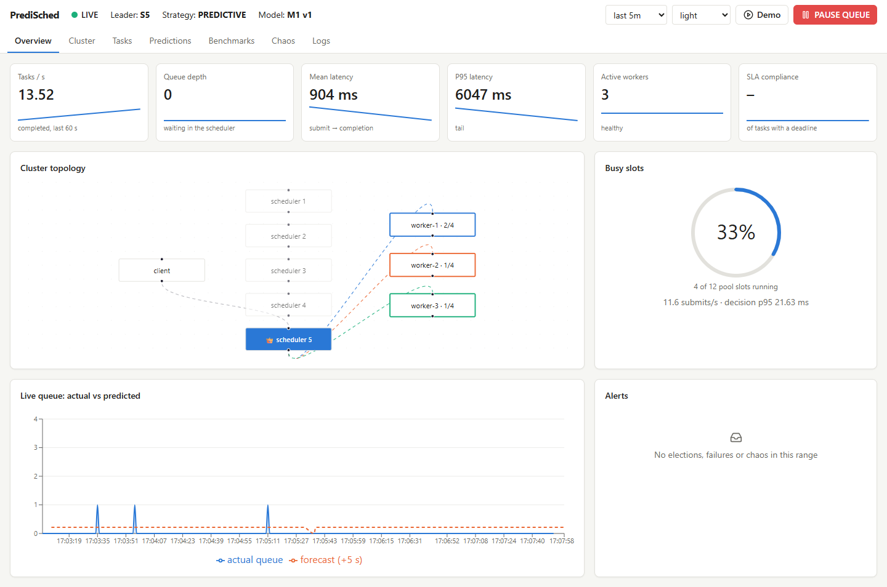 Overview | 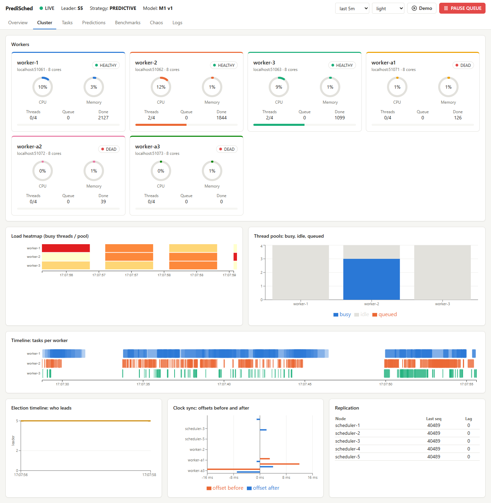 Cluster |
| 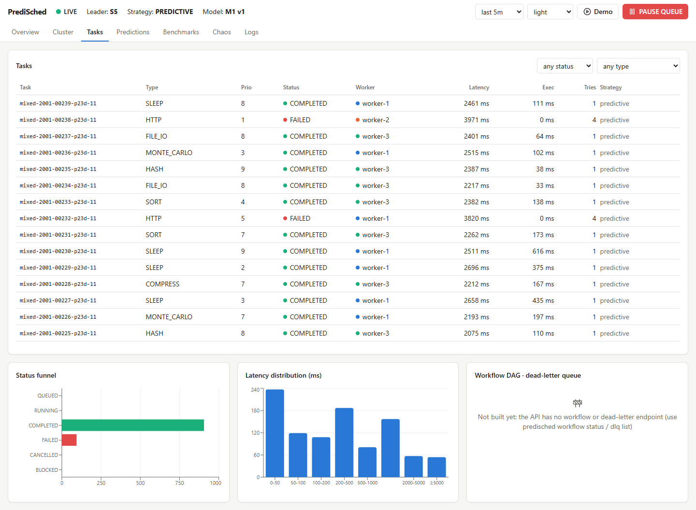 Tasks | 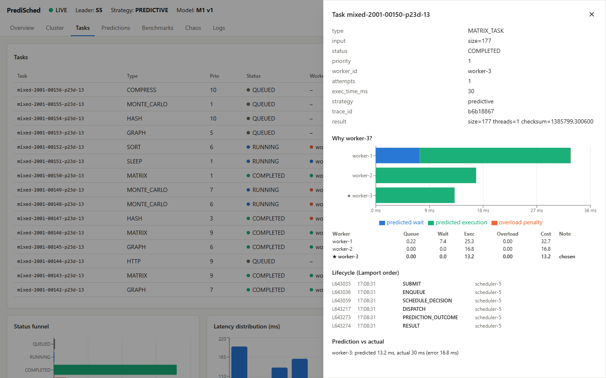 Task drawer: why worker-3 (predicted wait + execution per worker) |
| 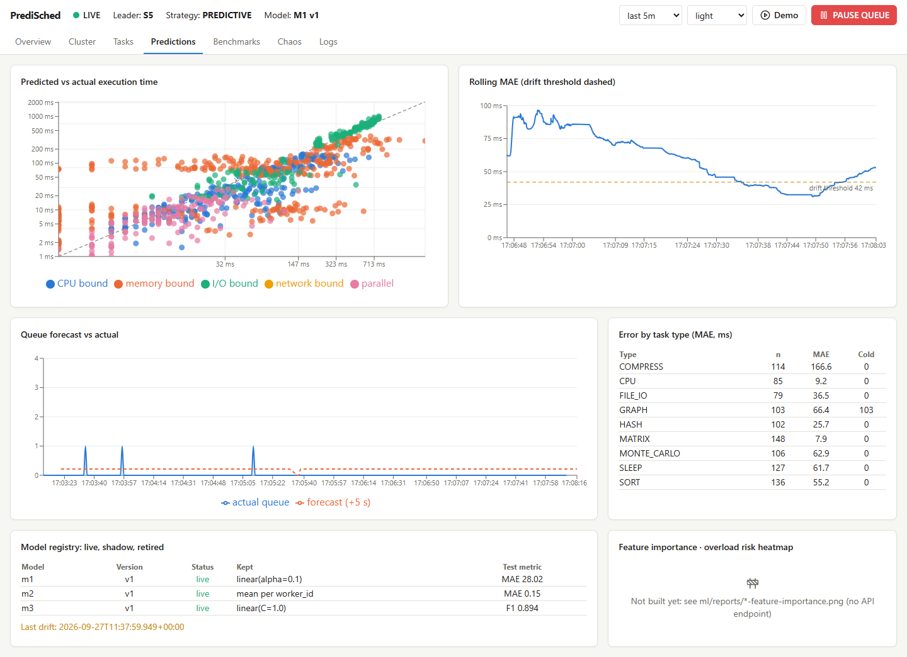 Predictions | 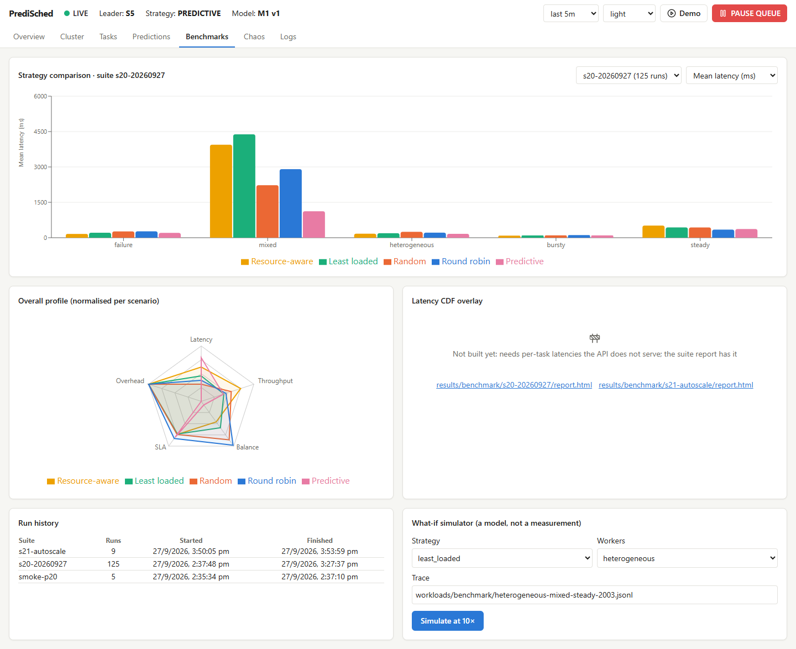 Benchmarks |
| 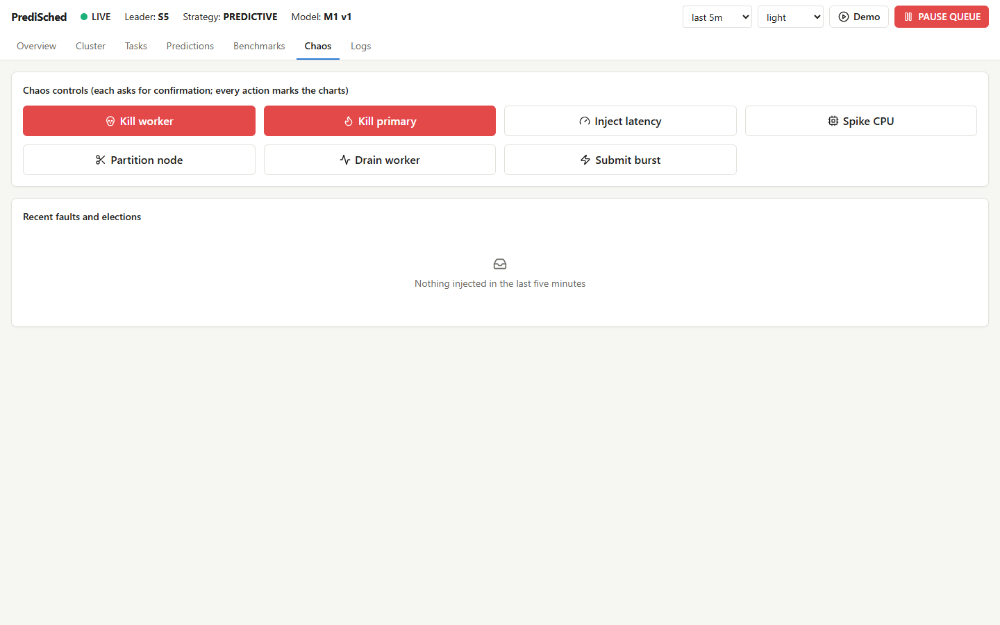 Chaos | 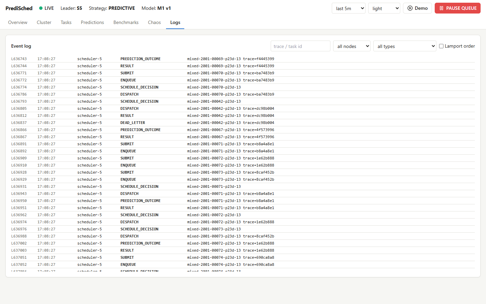 Logs |

**Failover, run from the Chaos page** (`CHAOS=1 npx playwright test e2e/screenshots.spec.ts`):
1. The test clicks *Kill primary* and confirms.
2. It waits for the top bar's leader to change.
3. It moves to Overview and then Cluster in-app, with keys `1` and `2`, so the stream buffer
   survives.

| | |
|---|---|
| 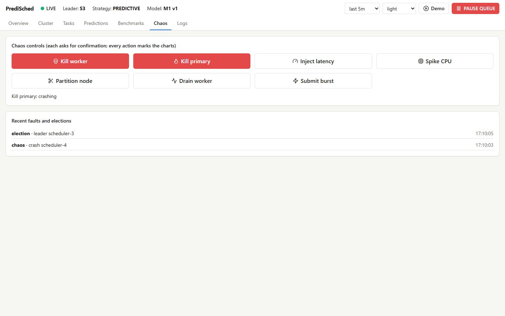 The fault is logged | 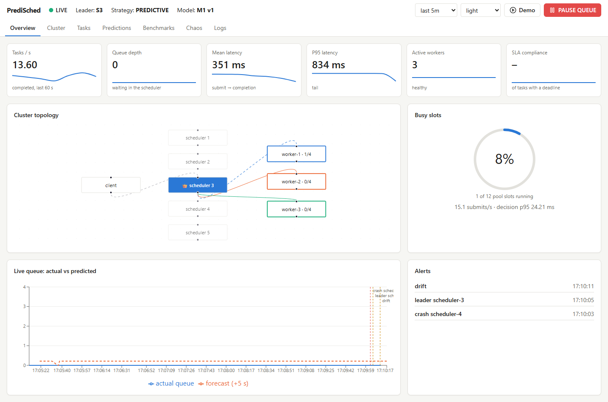 Topology shows the new leader; crash and election markers on the queue chart; Alerts list both |
| 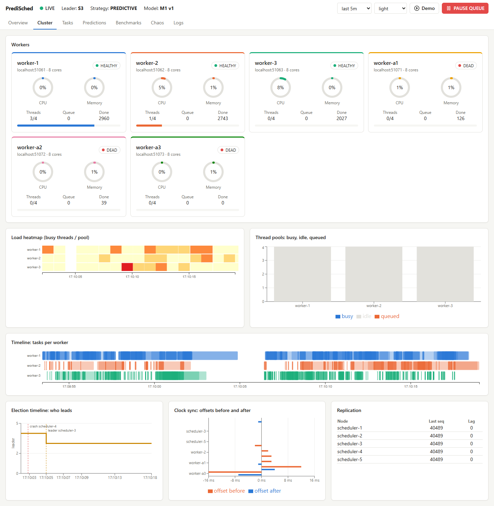 Election timeline: leader 5, no leader for about 3 s, then leader 4 | 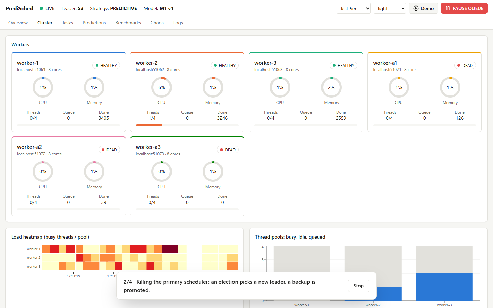 Demo mode, step 2 |

## Skipped widgets

Each shows a visible "Not built yet" state on its page, with where to look instead.

| Widget (spec) | Page | Why | Instead |
|---|---|---|---|
| Workflow DAG (§15.4) | Tasks | The API has no workflow endpoint | `predisched workflow status <id>` |
| Dead-letter queue (§15.4) | Tasks | The API has no dead-letter endpoint | `predisched dlq list` / `retry` |
| Feature importance (§15.5) | Predictions | No endpoint serves it | `ml/reports/*-feature-importance.png` |
| Overload risk heatmap per worker (§15.5) | Predictions | M3 probabilities are logged per decision, but the API has no aggregate | the explainer's overload column per decision |
| Latency CDF overlay (§15.6) | Benchmarks | Needs per-task latencies; the API serves per-run summaries | the suite report (`results/benchmark/*/report.html`), linked from the page |

## Tests

**Vitest + Testing Library**, `npm test`: 12 tests in 2 files.
- `components.test.tsx`:
  - KPI strip values and missing-value dashes, from a fixture `/api/overview`;
  - worker card rings, threads and status, and a dead worker;
  - the explainer parsing a stored `breakdown` and marking the winner, the skip reason and the
    fallback note.
- `stream.test.tsx`:
  - `useStomp` with a fake client: live → drop → reconnecting → live, the reconnect count, topic
    routing, deactivate on unmount, and offline when it never connected;
  - `throttle` capping 200 calls over 2 s to at most 9;
  - the store's 5-minute window, marker dedup, and `noteLeader`.

**Playwright**, against a live cluster, API and dev server:
- `e2e/smoke.spec.ts` loads all seven pages and fails on any console error or error panel: 7 passed.
  - One exception: Recharts 2.12 logs a React dev-mode `defaultProps` deprecation through
    `console.error`. That warning is the library's and is absent from production builds, so the test
    ignores it.
- `e2e/screenshots.spec.ts`: 9 passed with `CHAOS=1`. With `DEMO=1`, the demo test also runs all
  four steps once without a failed step.

**CI:** the `dashboard` job in `.github/workflows/ci.yml` runs `npm ci`, `npm run lint`, `npm test`
and `npm run build` on Node 20.

## Found while capturing

- **Predictions page saturating the main thread.** The page re-rendered its 1,000-point scatter on
  every stream update (4/s), and the screenshot call timed out.
  - Fix, part 1: the charts are now `memo`ised.
  - Fix, part 2: `useMarkers` returns a stable array that changes only when a marker is added or
    expires.
  - The capture took 6.7 s afterwards.
- **m1/m2 metrics missing from `/api/models`.** Python writes the baseline's CV threshold as a bare
  `NaN`, and Jackson refused the whole `meta.json`. `ModelController` now allows non-numeric numbers,
  and `ControllersTest.modelMetricsSurviveNaNInMeta` reads the real registry.
- **Demo mode restarting itself.** In React Router 6, `useNavigate` returns a new function after
  every route change, and the demo effect listed it as a dependency. The effect now reads `navigate`
  and the worker through refs and depends only on `open`.
- **Missing election marker after a failover.** The new primary's election happened before the
  stream reconnected to it; `noteLeader` covers this (above).

The production bundle is one 940 kB chunk (279 kB gzipped). Recharts, D3 and React Flow account for
most of it, and the page is a single-screen app on a LAN, so it is not split.
