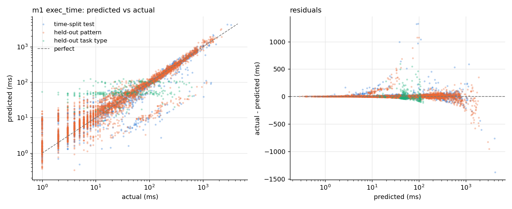
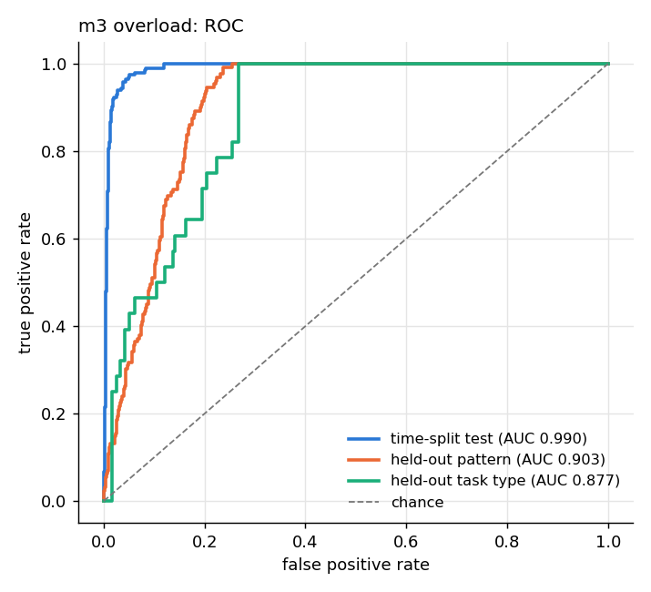

# ML models: execution time, queue forecast, overload risk

Prompt 16, spec §12.2. Three models are trained on the prompt 15 dataset (`ml/data/dataset.parquet`,
`docs/components/dataset.md`):

| Model | Target | Kind | Primary metric | Kept (v1) |
| --- | --- | --- | --- | --- |
| M1 execution time | `exec_time_ms` | regression (on log1p ms) | MAE | ridge regression |
| M2 queue forecast | `queue_len_future` (5 s ahead) | regression | MAE | **baseline**: mean per worker |
| M3 overload risk | `overloaded_future` (5 s ahead) | classification | F1 | logistic regression |

## Layout

- `ml/predisched_ml/`, run from `ml/`:
  - `features.py`: `build_features()`, the one function that turns dataset rows or a serving
    request into the feature matrix. The prediction server (prompt 17) calls it too.
  - `data.py`: loads the dataset and makes the split.
  - `models.py`: baselines, candidates, and `ExecTimeModel` (cold start).
  - `train.py` and `evaluate.py`.
  - `infer.py`: the `ML_INFER_TASK` entry point.
  - `registry.py`: versioned model files.
  - `metrics.py`.
- `ml/config.yaml`: split, CV folds, the selection margin, grids and seed.
- `ml/models/<m>/v<N>/model.joblib` and `meta.json`, plus `ml/models/registry.json`, which lists
  the versions and which is live.
  - `meta.json` holds the features, every candidate's CV and test metrics, the kept candidate with
    the reason, the dataset's SHA-256, the training date, the seed and library versions.
  - The joblib binaries are not committed: `python -m predisched_ml.train` rebuilds them, with the
    same metrics, from the committed dataset. `meta.json` and `registry.json` are committed.
- `ml/reports/`: `<m>-candidates.md` (training tables), `<m>-report.md` (evaluation, per task type)
  and the plots.

## Features

`build_features()` produces 51 columns (`FEATURE_NAMES`, float64, fixed order):

- **Task**:
  - one-hot task type over the fixed catalogue (13 types, not the types seen in data, so the columns
    never depend on the data);
  - one-hot resource profile;
  - `log_size = log1p(input size)`, plus `log_size x type` interactions, so a linear model can
    give each type its own size scaling;
  - priority.
  - The input size is the type's first required key (`n`, `ms`, `size`, `rounds`, ...), the same as
    `TaskInputSpec.inputSize` in Java. A serving request may send the raw `input` string instead,
    and `input_size()` parses it the same way.
- **Worker at dispatch**: cores, pool size, slowdown, concurrent tasks, CPU %, memory %, active
  threads, queue length, arrival rate, `busy_ratio = active / pool`, `queue_ratio = queue / pool`,
  and `log1p(avg_exec_recent)`.
- **Leak-free history**:
  - `has_prior`, `log1p(prior_type_worker_mean_ms)` and `log1p(prior_type_worker_count)`: the mean
    over executions of the same (type, worker) that finished before this dispatch;
  - the latest Spark worker window that had ended.
- `strategy` and `worker_id` are left out. The strategy is unknown when the predictive scheduler
  asks, and worker ids do not carry over to another cluster; pool and slowdown describe the worker
  instead.

M1 fits `log1p(exec_time_ms)` and predicts `expm1`. Execution times run from 1 ms to 3 s, and on the
raw scale a squared-error fit is dominated by the slowest types.

## Split and selection

- **Hold-outs first.** From the dataset card, the `periodic` pattern (3,578 rows) and `GRAPH_TASK`
  (268 rows, all patterns) never reach training. A periodic `GRAPH_TASK` row counts toward the
  type set, which is the stricter test.
- **Time split.** Rows are sorted by dispatch time. The earliest 80 % train (5,978 rows, up to
  12:51:37.484) and the rest test (1,494 rows, from 12:51:37.493). There is no shuffling.
  - The campaign ran its runs grouped by strategy, so the test set is mostly `resource_aware`
    runs: a later period *and* a strategy the training part saw less of.
- **Candidates, simplest first**:
  1. the baselines, which are always evaluated:
     - M1: the mean per task type;
     - M2: persistence (the queue now) and the mean per worker;
     - M3: majority class and the overload rate per worker;
  2. ridge or logistic regression (standardised features; logistic with balanced class weights);
  3. random forest;
  4. XGBoost (M3 uses `scale_pos_weight = negatives / positives`).
- **Grid search** over α or C, forest depth and leaf size, and XGBoost depth and learning rate. It
  uses 3-fold `TimeSeriesSplit` inside the training part only, scored on the pooled out-of-fold
  predictions.
- **M3 threshold.** Each candidate's decision threshold is the one with the best F1 on those
  out-of-fold predictions. Baselines get the same treatment, except majority class, which always
  predicts "not overloaded".
- **Selection** also uses the CV scores, never the test set. The kept model is the simplest family
  whose CV primary metric beats the best baseline by the margin in `config.yaml` (10 %): MAE at
  most 0.9x the baseline's, or F1 at least 1.1x. If no family qualifies, the baseline is kept.
- **Final scoring.** Each family's best grid point is then refitted on the whole training part and
  scored on the test set and both hold-outs.

## Results

`python -m predisched_ml.train --model all` (about 60 s), then
`python -m predisched_ml.evaluate --model all`. The numbers below are copied from
`ml/reports/*-candidates.md`. Bold marks the kept model.

### M1: execution time (ms)

Cross-validated MAE (selection): mean per task type 79.86. The best grid point per family:

| Family | Grid point | CV MAE |
| --- | --- | --- |
| Linear | α=0.1 | 26.02 |
| Random forest | depth 16, leaf 1 | 17.92 |
| XGBoost | depth 6, lr 0.05 | 22.45 |

Kept: **ridge (α=0.1)**. It is the simplest candidate that beats the baseline by at least 10 %
(26.02 vs 79.86). The random forest and XGBoost score better on CV but are more complex, so the
rule does not pick them.

| Set | Candidate | MAE | RMSE | R² |
| --- | --- | --- | --- | --- |
| time-split test | mean per task type | 92.74 | 197.65 | 0.358 |
| | **ridge α=0.1** | **28.02** | **96.64** | **0.847** |
| | random forest | 15.69 | 57.15 | 0.946 |
| | XGBoost | 20.44 | 61.12 | 0.939 |
| held-out pattern | mean per task type | 83.73 | 174.57 | 0.406 |
| | **ridge α=0.1** | **20.87** | **63.51** | **0.921** |
| | random forest | 19.29 | 80.90 | 0.873 |
| | XGBoost | 20.53 | 69.97 | 0.905 |
| held-out type (GRAPH_TASK) | mean per task type | 95.13 | 115.52 | -0.225 |
| | ridge α=0.1 (model as is) | 37.15 | 78.66 | 0.432 |
| | random forest | 64.92 | 121.04 | -0.345 |
| | XGBoost | 64.51 | 120.37 | -0.330 |
| | **ridge + cold-start fallback** (268 rows flagged) | **60.69** | **103.19** | **0.023** |

Per task type on the test set (kept model):

| Task type | Rows | Mean actual | MAE |
| --- | --- | --- | --- |
| COMPRESS_TASK | 71 | 378.1 | 94.8 |
| CPU_TASK | 249 | 5.6 | 1.8 |
| FILE_IO_TASK | 145 | 47.3 | 14.7 |
| HASH_TASK | 56 | 16.9 | 4.6 |
| HTTP_TASK | 155 | 201.0 | 23.1 |
| MATRIX_TASK | 248 | 57.1 | 21.5 |
| MONTE_CARLO_TASK | 63 | 79.8 | 8.5 |
| SLEEP_TASK | 288 | 396.5 | 30.6 |
| SORT_TASK | 219 | 66.2 | 64.1 |

Reading the results:

- Every model beats the per-type mean by a wide margin (about 3x lower MAE). The mean ignores size,
  the slowdown of worker-1 and the load.
- The ridge model generalises to the unseen `periodic` pattern (MAE 20.9, R² 0.92). There it beats
  both tree models on RMSE.
- `SORT_TASK` and `COMPRESS_TASK` carry most of the remaining error: their time depends on the
  input distribution and level, not just the size.

**Cold start.** `ExecTimeModel` flags any type that is not in the training set as `cold_start` and
predicts the type's running mean. That is `type_running_mean_ms` from the scheduler, or the
dataset's `prior_type_worker_mean_ms`; with neither, it uses the global mean of 123 ms. On
`GRAPH_TASK` this rule does worse than the ridge model left alone: MAE 60.7 vs 37.2. The model
still has `log_size`, the worker and the load to go on, while the running mean starts empty and
covers `bfs` and `pagerank` alike. The rule is kept as the spec asks and the result is reported as
measured. Prompt 17 serves the flag, so the scheduler knows which predictions are guesses. The tree
models extrapolate worst of all (R² below 0).

### M2: queue length 5 s ahead

CV MAE: persistence 0.1140, mean per worker 0.1017, ridge (α=10) 0.0999, random forest (depth 16,
leaf 5) 0.1050, XGBoost (depth 6, lr 0.1) 0.1080.

Kept: **the baseline, mean per worker**. No candidate beat it by 10 % on CV; the best, ridge, is
1.8 % better.

| Set | Candidate | MAE | RMSE | R² |
| --- | --- | --- | --- | --- |
| time-split test | persistence (queue now) | 0.187 | 0.607 | -0.601 |
| | **mean per worker** | **0.149** | **0.450** | **0.118** |
| | ridge α=10 | 0.183 | 0.415 | 0.252 |
| | random forest | 0.167 | 0.434 | 0.179 |
| | XGBoost | 0.219 | 0.534 | -0.238 |
| held-out pattern | persistence | 0.054 | 0.281 | -1.331 |
| | **mean per worker** | **0.078** | **0.194** | **-0.109** |
| | ridge α=10 | 0.079 | 0.200 | -0.178 |
| | random forest | 0.120 | 0.330 | -2.213 |
| | XGBoost | 0.126 | 0.348 | -2.587 |
| held-out type | persistence | 0.112 | 0.432 | 0.013 |
| | **mean per worker** | **0.158** | **0.412** | **0.104** |
| | ridge α=10 | 0.115 | 0.409 | 0.116 |
| | random forest | 0.112 | 0.363 | 0.302 |
| | XGBoost | 0.089 | 0.327 | 0.433 |

In plain words, **no model beats the baseline for M2**. The target has almost no signal in this
dataset: the queue is 0 in 96 % of rows, and only worker-1 ever queues. As `dataset.md` explains,
the scheduler caps each worker's outstanding tasks. The mean per worker already captures "worker-1
may have a queue". Ridge has a better RMSE on the test set, but its MAE is worse, and the kept
model was chosen on CV MAE, not test scores. Better queue forecasts need a campaign that actually
builds worker queues (a higher `outstandingPerWorkerFactor`, or more load). That is noted for the
prompt 21 retraining loop.

### M3: overload within 5 s

CV F1 (with each candidate's CV-chosen threshold):

| Candidate | CV F1 | Threshold |
| --- | --- | --- |
| majority class | 0.000 | fixed |
| rate per worker | 0.488 | 0.137 |
| logistic (C=1) | 0.568 | 0.806 |
| random forest (depth 16, leaf 5) | 0.552 | 0.216 |
| XGBoost (depth 6, lr 0.05) | 0.572 | 0.016 |

Kept: **logistic regression (C=1)**. Its CV F1 of 0.568 beats the best baseline's 0.488 by more
than 10 %. XGBoost is 0.004 better on CV but more complex.

| Set | Candidate | Precision | Recall | F1 | ROC-AUC |
| --- | --- | --- | --- | --- | --- |
| time-split test (196 of 1,494 positive) | majority class | 0.000 | 0.000 | 0.000 | 0.500 |
| | rate per worker | 0.544 | 1.000 | 0.705 | 0.937 |
| | **logistic C=1** | **0.866** | **0.923** | **0.894** | **0.990** |
| | random forest | 0.614 | 1.000 | 0.761 | 0.992 |
| | XGBoost | 0.698 | 1.000 | 0.822 | 0.983 |
| held-out pattern (129 of 3,578) | majority class | 0.000 | 0.000 | 0.000 | 0.500 |
| | rate per worker | 0.125 | 1.000 | 0.223 | 0.869 |
| | **logistic C=1** | **0.180** | **0.357** | **0.240** | **0.903** |
| | random forest | 0.169 | 0.837 | 0.281 | 0.909 |
| | XGBoost | 0.150 | 0.767 | 0.251 | 0.899 |
| held-out type (28 of 268) | majority class | 0.000 | 0.000 | 0.000 | 0.500 |
| | rate per worker | 0.301 | 1.000 | 0.463 | 0.865 |
| | **logistic C=1** | **0.583** | **0.250** | **0.350** | **0.877** |
| | random forest | 0.489 | 0.786 | 0.603 | 0.942 |
| | XGBoost | 0.513 | 0.714 | 0.597 | 0.937 |

On the time-split test the kept model is strong: F1 0.89 and ROC-AUC 0.99. On the unseen `periodic`
pattern, ranking holds (AUC 0.90), but the threshold learned on steady and bursty traffic is too
high. Recall falls to 0.36, and the F1 of 0.24 is barely above the per-worker rate's. Periodic
traffic overloads worker-1 in shorter waves: 3.6 % of rows are positive against 13 % on the test
set. The honest conclusion is that M3 ranks risk well across patterns, but its threshold does not
transfer. Prompt 18's cost function uses `overload_prob` as a continuous penalty, not the 0/1
label, which is the part that holds up.

## Plots

- **M1 predicted vs actual**, on log axes, for the test set and both hold-outs. The `GRAPH_TASK`
  cold-start band is flat because it predicts the running mean.

  
- **M3 ROC.**

  
- **Feature importance**: `ml/reports/m1-feature-importance.png` and
  `ml/reports/m3-feature-importance.png`. The linear models show |coefficient| on standardised
  features. M2's kept baseline has no feature importance.
- **M2 predicted vs actual**: `ml/reports/m2-predicted-vs-actual.png`.

## ML_INFER_TASK

`ML_INFER_TASK model=exec_time|queue_forecast|overload, batch=<1..1000000>, [seed=s]` is a
`CPU_BOUND` task. The worker runs `python -m predisched_ml.infer` in `ml.workDir`. It loads the
live model, predicts on `batch` seeded rows of the dataset and returns the version, the timings and
a checksum of the predictions. The same seed gives the same checksum, which a JUnit test checks
against the real venv when one exists.

The executor is disabled until `ml.python` is set: `configs/ml.yaml` sets it to the repo venv.

Live, through the scheduler (`configs/ml.yaml`, one worker):

```
task_id=task-e87e3afa status=COMPLETED worker=worker-1 exec_ms=2695 attempts=1 result='model=exec_time version=1 batch=5000 seed=11 load_ms=1142.243 predict_ms=40.128 per_row_us=8.026 checksum=583363.805096'
task_id=task-d292a376 status=COMPLETED worker=worker-1 exec_ms=3093 attempts=1 result='model=queue_forecast version=1 batch=5000 seed=11 load_ms=1437.564 predict_ms=1.088 per_row_us=0.218 checksum=330.830381'
task_id=task-a69a29b4 status=COMPLETED worker=worker-1 exec_ms=2694 attempts=1 result='model=overload version=1 batch=5000 seed=11 load_ms=1106.093 predict_ms=20.735 per_row_us=4.147 checksum=978.317206'
```

Loading the model, which imports scikit-learn and XGBoost, takes about 1.1 s. Predicting a row
takes 0.2–8 µs. Most of each task's 2.7 s is Python start-up and loading the dataset, which is
why prompt 17 keeps the models in a long-running server.

## Tests

`pytest` in `ml/` (14 tests, 5 of them from prompt 15):

- Features are identical for a training batch and for the same rows sent one at a time as dicts,
  and for the raw `input` string against `input_size`. An unknown type still gets every column.
- The time split keeps order, and the train, test and hold-out sets do not overlap. Hold-out rows
  never reach training.
- A trained model round-trips through joblib and the registry (version numbers, `live`).
- The cold-start rule: the fallback order and the flags.
- The baselines are evaluated in CV and on every evaluation set, for each of M1, M2 and M3.
- The margin rule.

JUnit: `MlInferTaskExecutorTest` checks the command, validation, the disabled state and a live
batch, and `TaskInputSpecTest` checks the new input keys.
