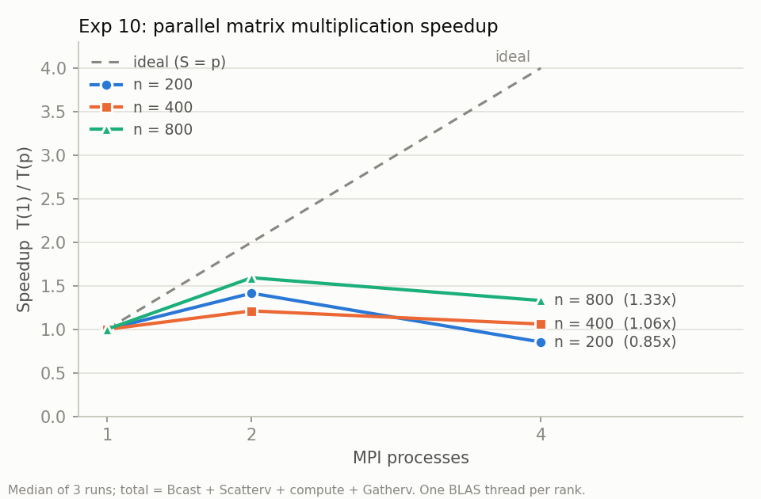

# MPI: collectives over PrediSched tasks (Exp 9)

An mpi4py program in which rank 0 plays the scheduler:

1. It broadcasts the scheduling configuration.
2. It scatters a batch of PrediSched tasks across the ranks.
3. Each rank runs its chunk with the same task semantics as the Java workers.
4. Rank 0 gathers the results and timings.

Built by `spec/prompts/13-mpi-collectives.md`. Spec sections: §4 FR21, §8 (MPI row), §8.1, §11
Exp 9. The second half, parallel matrix multiplication (Exp 10), is by prompt 14.

## Layout

| Path | What |
| --- | --- |
| `mpi/predisched_mpi/tasks.py` | `CPU_TASK`, `HASH_TASK`, `MONTE_CARLO_TASK`, `SLEEP_TASK` in Python, with the Java executors' exact outputs |
| `mpi/predisched_mpi/collectives.py` | The Exp 9 program |
| `mpi/predisched_mpi/matmul.py` | The Exp 10 program: Bcast, Scatterv, local multiply, Gatherv |
| `scripts/plot-matmul.py` | Speedup/efficiency table and `docs/img/exp10-speedup.png` |
| `configs/mpi.yaml` | `configs/local.yaml` plus a worker `mpi:` section for `MATRIX_TASK mode=mpi` |
| `testdata/task-outputs.json` | Shared fixtures (type, input, success, output), asserted by both `mpi/tests/test_tasks.py` and `TaskOutputsFixtureTest` (Java) |
| `mpi/requirements.txt` | mpi4py 4.1.2, NumPy, pytest; on Windows also `impi_rt` |
| `docker/mpi.Dockerfile`, `scripts/run-mpi.ps1` / `.sh` | Run on N ranks natively or in Docker (OpenMPI), whichever is available |

## Collectives and what they stand for in the scheduler

| Step | mpi4py call | Scheduler equivalent |
| --- | --- | --- |
| Broadcast | `comm.bcast(config, root=0)`: task filter, seed, source, batch size, split policy | Every worker shares one configuration |
| Scatter (objects) | `comm.scatter(chunks, root=0)`: task *i* goes to rank *i* mod *size* | Dispatch: each worker gets its share of the queue |
| Scatter (buffer) | `comm.Scatter` of an int64 matrix `(size, ceil(n/size))` of task sizes, padded with -1 | The same dispatch with fixed-size typed buffers. Each rank checks the row it gets against its object chunk |
| Execute | `tasks.execute` per task, timed with `perf_counter` | Worker thread pool |
| Gather (objects) | `comm.gather` of `(task_id, type, input, output, exec_ms, rank)` | Result collection |
| Gather (buffer) | `comm.Gather` of each rank's busy time into a float64 array | Heartbeat metrics |

Rank 0 then prints two tables. The per-rank table shows task count, size sum and busy time, plus
makespan and balance (max/mean). The combined table is sorted by task id. Rank 0 also writes
`results/exp9-collectives.csv`.

Every rank prefixes its log lines with `[rank r/size]`. Each rank logs the config it received, its
chunk, its size buffer, and each result it returns.

- A task whose type is not in the broadcast filter comes back as `SKIPPED`.
- An input error comes back as `FAILED: <reason>`.
- With `--trace ../workloads/<file>.jsonl`, rank 0 reads a prompt 05 trace instead of generating.
  Trace types other than the four above are skipped.

## Same results as the Java workers

`tasks.py` parses inputs with the same rules as `InputParser` (comma-separated `key=value`, trimmed)
and returns the same strings:

- **CPU_TASK:** a sieve counting primes below `n`.
- **HASH_TASK:** SHA-256 chained `rounds` times, starting from `predisched-hash-payload`.
- **MONTE_CARLO_TASK:** a port of `java.util.Random` (the 48-bit LCG and `nextDouble`), so seed 7
  gives the same count of points inside the circle as the JVM.
- **SLEEP_TASK:** a sleep. Its optional injected failure draws `Random(seed + attempt)` on the first
  attempt. Without a seed it uses a port of `String.hashCode` of the input, as the Java executor
  does.

`testdata/task-outputs.json` pins 14 cases, including a 2,000,000-prime sieve, 100,000 hash rounds,
1,000,000 Monte Carlo samples and an injected failure. The Python tests and the Java
`TaskOutputsFixtureTest` both assert every case, so the two implementations cannot drift apart. The
outputs also match live tasks run through the scheduler earlier:

- `primes_below_2000000=148933`
- `samples=1000000 seed=7 inside=785563`
- `digest=9a640c9c...388` for 100,000 rounds

A side finding: `new Random(seed).nextDouble()` is about 0.73 for every small seed, so
`failRate=0.5` never fails on its first attempt for seeds 0–19. The failure fixture therefore uses
`failRate=0.9`.

## Setup

### Windows: Intel MPI from PyPI (used here)

```bash
python -m pip install -r mpi/requirements.txt
```

On Windows that installs `impi_rt`, Intel's MPI runtime, as a wheel. It puts `mpiexec.exe` and
`impi.dll` in `<venv>\Library\bin`, and mpi4py finds the library there. Nothing else needs
installing, and no admin rights or `hydra_service` are required for local runs. Put
`<venv>\Library\bin` on `PATH`, or use `scripts/run-mpi.ps1`, which does it for you.

The spec names MS-MPI, which needs two system installers. Both work with mpi4py:

1. Download `msmpisetup.exe` (the runtime) and `msmpisdk.msi` (the SDK) from Microsoft's MS-MPI
   page, and install both.
2. Open a new terminal. `mpiexec` should now be on `PATH` (`C:\Program Files\Microsoft MPI\Bin`),
   and `MSMPI_BIN` should be set.
3. `pip install mpi4py numpy`, then run the same commands. `run-mpi.ps1` prefers an `mpiexec` on
   `PATH`.

### Linux

```bash
sudo apt-get install -y openmpi-bin libopenmpi-dev
python -m pip install -r mpi/requirements.txt
```

In Docker, with no local MPI needed:

```bash
docker build -f docker/mpi.Dockerfile -t predisched-mpi .
docker run --rm -v "$PWD:/work" predisched-mpi 4 predisched_mpi.collectives --generate 20 --seed 42
```

The image sets `OMPI_ALLOW_RUN_AS_ROOT` and `oversubscribe`, so it runs on any core count.
`scripts/run-mpi.sh <ranks> <module> [args]` picks a native `mpiexec` (`PATH`, then the repo's
`.venv`) and falls back to Docker. CI installs OpenMPI on the Linux runner and runs `pytest` in
`mpi/`.

## Real output

Measured on 2026-09-27 (Windows 11, 8 cores, Python 3.12, mpi4py 4.1.2, Intel MPI 2021.18.1):

```bash
cd mpi && mpiexec -n 4 python -m predisched_mpi.collectives --generate 20 --seed 42
```

Rank-wise logs (excerpt; the lines of different ranks interleave):

```
[rank 0/4] broadcasting config {'task_filter': ['CPU_TASK', 'HASH_TASK', 'MONTE_CARLO_TASK', 'SLEEP_TASK'], 'seed': 42, 'source': 'generate 20 seed 42', 'batch_size': 20, 'split': 'round_robin'}
[rank 0/4] received config: filter=['CPU_TASK', 'HASH_TASK', 'MONTE_CARLO_TASK', 'SLEEP_TASK'] batch=20
[rank 2/4] received config: filter=['CPU_TASK', 'HASH_TASK', 'MONTE_CARLO_TASK', 'SLEEP_TASK'] batch=20
[rank 3/4] received config: filter=['CPU_TASK', 'HASH_TASK', 'MONTE_CARLO_TASK', 'SLEEP_TASK'] batch=20
[rank 1/4] received config: filter=['CPU_TASK', 'HASH_TASK', 'MONTE_CARLO_TASK', 'SLEEP_TASK'] batch=20
[rank 1/4] received 5 tasks: ['mpi-42-00001', 'mpi-42-00005', 'mpi-42-00009', 'mpi-42-00013', 'mpi-42-00017']
[rank 0/4] received 5 tasks: ['mpi-42-00000', 'mpi-42-00004', 'mpi-42-00008', 'mpi-42-00012', 'mpi-42-00016']
[rank 2/4] received 5 tasks: ['mpi-42-00002', 'mpi-42-00006', 'mpi-42-00010', 'mpi-42-00014', 'mpi-42-00018']
[rank 3/4] received 5 tasks: ['mpi-42-00003', 'mpi-42-00007', 'mpi-42-00011', 'mpi-42-00015', 'mpi-42-00019']
[rank 0/4] received sizes buffer [102451, 18, 197700, 193013, 34] (matches the object scatter)
[rank 3/4] received sizes buffer [1288352, 1227016, 11703, 36793, 147] (matches the object scatter)
[rank 2/4] received sizes buffer [36868, 70990, 160, 50758, 21390] (matches the object scatter)
[rank 1/4] received sizes buffer [74196, 246493, 66, 97, 100165] (matches the object scatter)
[rank 2/4] returning mpi-42-00002 in 38.0 ms: rounds=36868 digest=1c1c72852846c87d3851dfc0705c17dc9db123426265809a0d42738a5fc450f7
[rank 0/4] returning mpi-42-00000 in 8.7 ms: primes_below_102451=9809
[rank 3/4] returning mpi-42-00003 in 144.8 ms: primes_below_1288352=99212
[rank 1/4] returning mpi-42-00001 in 179.0 ms: samples=74196 seed=228 inside=58302 pi_estimate=3.143134
...
```

Rank 0:

```
Per rank (4 ranks, 20 tasks)
  rank  tasks    size_sum    busy_ms
     0      5      493216      499.7
     1      5      421017      581.3
     2      5      180166      442.7
     3      5     2564011      502.2
  makespan 581.3 ms, total work 2025.9 ms, balance (max/mean) 1.15

Combined result
  mpi-42-00000  CPU_TASK          rank 0      8.7 ms  primes_below_102451=9809
  mpi-42-00001  MONTE_CARLO_TASK  rank 1    179.0 ms  samples=74196 seed=228 inside=58302 pi_estimate=3.143134
  mpi-42-00002  HASH_TASK         rank 2     38.0 ms  rounds=36868 digest=1c1c72852846c87d3851dfc0705c17dc9db123426265809a0d42738a5fc450f7
  mpi-42-00003  CPU_TASK          rank 3    144.8 ms  primes_below_1288352=99212
  mpi-42-00004  SLEEP_TASK        rank 0     18.4 ms  slept_ms=18
  mpi-42-00005  CPU_TASK          rank 1     17.0 ms  primes_below_246493=21749
  ...

RESULTS 20 written to C:\CODING\predisched\results\exp9-collectives.csv
```

The same batch on different rank counts, one run each:

| Ranks | Makespan | Total work | Balance (max/mean) |
| --- | --- | --- | --- |
| 1 | 2092.8 ms | 2092.8 ms | 1.00 |
| 2 | 1305.5 ms | 2519.6 ms | 1.04 |
| 4 | 864.9 ms (581.3 ms in the run above) | 2864.8 ms | 1.21 |

With 4 ranks the makespan falls 2.4–3.6x. Total work grows with the rank count because the ranks
compete for memory bandwidth and CPU boost on one machine. Round-robin balances task *counts*, not
sizes: rank 3 got 2.56 M of size units against 0.18 M for rank 2. Busy times still stay within
1.2x, because the size units of different task types are not comparable. That is the imbalance a
size-aware or predictive split (prompt 18) would address.

## Parallel matrix multiplication (Exp 10)

Built by `spec/prompts/14-mpi-matrix.md`. Spec sections: §4 FR21, §7.2 (`MATRIX_TASK`), §11 Exp 10.

`mpi/predisched_mpi/matmul.py` computes C = A @ B for n × n float64 matrices:

| Step | Call | Detail |
| --- | --- | --- |
| Build | rank 0 | A and B from `java.util.Random(seed)`, alternating `a[i][j]`, `b[i][j]`, exactly as `MatrixTaskExecutor` fills them (default seed 42) |
| Broadcast | `comm.Bcast(B)` | every rank needs all of B |
| Scatter | `comm.Scatterv` of A's rows | `counts_and_displacements(n, p)`: the first `n % p` ranks get one extra row, so any n works on any p (n=7 on 4 ranks: 2, 2, 2, 1) |
| Compute | `A_block @ B` | NumPy, one BLAS thread per rank |
| Gather | `comm.Gatherv` into C | same counts and displacements |
| Verify | rank 0 | `np.allclose(C, A @ B)` against the sequential product |

A few details:

- Timing uses `MPI.Wtime()` after a barrier, in three phases: Bcast + Scatterv, compute, and
  Gatherv. Each phase reports its slowest rank (`Reduce` with `MAX`).
- `OMP_NUM_THREADS`, `OPENBLAS_NUM_THREADS` and `MKL_NUM_THREADS` are set to 1 before NumPy loads.
  Otherwise the 1-process baseline would already use every core through BLAS, and the speedup
  would measure nothing.
- Building A and B needs 2n² Java-random draws (1.28 M for n=800). `tasks.java_random_doubles`
  vectorises the 48-bit LCG with jump-ahead blocks, s[k+4096] = A·s[k] + C (mod 2^48), and builds
  n=800 in 48 ms. It is tested bit for bit against the scalar port.

**Same checksum as Java.** The fixture `MATRIX_TASK size=64, seed=1` gives
`checksum=66454.893142`. Both `TaskOutputsFixtureTest` (Java) and `tasks.matrix_checksum_exact`
(pure Python, same summation order) produce exactly that value. The BLAS product sums in a
different order, so `test_numpy_checksum_agrees_with_the_java_fixture` compares it to 1e-9
relative. In practice all 6 printed decimals agree: n=200 gives `1997209.445178`, n=400 gives
`16009981.328371`, and n=800 gives `128052701.488846` on both sides.

### Running

```bash
scripts/run-mpi.sh matmul --sizes 200,400,800 --repeat 3     # runs on -n 1, 2, 4 ($MPI_RANKS)
python scripts/plot-matmul.py results/exp10-matmul.csv       # table + docs/img/exp10-speedup.png
cd mpi && mpiexec -n 4 python -m predisched_mpi.matmul --size 400 --seed 42 [--json]
```

Without a rank count, `run-mpi` runs the module on each of `$MPI_RANKS` (default `1 2 4`).
`matmul --sizes` replaces only its own process count's rows in `results/exp10-matmul.csv`. A module
name without a dot is short for `predisched_mpi.<name>`.

### MATRIX_TASK through MPI

```
MATRIX_TASK  size=<1..1000>, [seed=42], [threads=<1..64>], [mode=local|threads|mpi], [procs=<1..64>]
```

- `mode=local` (the default) and `mode=threads` / `threads=k` are the prompt 02 behaviour and
  output, unchanged.
- `mode=mpi` runs `mpiexec -n <procs> <python> -m predisched_mpi.matmul --size n --seed s --json`
  in `mpi.workDir`, parses the JSON line, and fails the task unless `verified` is true. The result
  carries the checksum and phase timings.
- The task is killed on timeout or on cancel (`FR26`), including the ranks. The resource profile is
  `PARALLEL`.
- With an empty `mpi.exec` (the default), `mode=mpi` fails with
  `MATRIX_TASK mode=mpi is disabled on this worker: mpi.exec is not configured`. A `procs` above
  `mpi.maxProcs` is refused.

```yaml
mpi:                                  # configs/mpi.yaml
  exec: ".venv/Library/bin/mpiexec.exe"   # or "mpiexec" on PATH (MS-MPI, OpenMPI)
  python: ".venv/Scripts/python.exe"
  workDir: "mpi"
  maxProcs: 4
  timeoutMs: 120000
```

### Real output

Measured on 2026-09-27 on an Intel Core i5-8350U: 4 cores / 8 threads, a 15 W laptop CPU. Windows
11, Python 3.12, NumPy 2.1.3 (OpenBLAS, one thread per rank), Intel MPI 2021.18.1.

`scripts/run-mpi.sh matmul --sizes 200,400,800 --repeat 3`, correctness lines:

```
check n=200 procs=1: np.allclose(C, A @ B) = True (max |diff| 0.00e+00), checksum 1997209.445178
check n=400 procs=1: np.allclose(C, A @ B) = True (max |diff| 0.00e+00), checksum 16009981.328371
check n=800 procs=1: np.allclose(C, A @ B) = True (max |diff| 0.00e+00), checksum 128052701.488846
check n=200 procs=2: np.allclose(C, A @ B) = True (max |diff| 0.00e+00), checksum 1997209.445178
  ... the same for n=400, 800 on 2 processes and all three sizes on 4: all True
```

`python scripts/plot-matmul.py results/exp10-matmul.csv` (medians of 3):

| n | procs | Bcast + Scatterv | compute | Gatherv | total | speedup | efficiency |
| --- | --- | --- | --- | --- | --- | --- | --- |
| 200 | 1 | 0.201 ms | 0.775 ms | 0.183 ms | 1.224 ms | 1.00x | 100% |
| 200 | 2 | 0.368 ms | 0.377 ms | 0.147 ms | 0.865 ms | 1.42x | 71% |
| 200 | 4 | 0.829 ms | 0.366 ms | 0.358 ms | 1.433 ms | 0.85x | 21% |
| 400 | 1 | 0.440 ms | 4.137 ms | 0.389 ms | 4.973 ms | 1.00x | 100% |
| 400 | 2 | 0.988 ms | 2.230 ms | 0.468 ms | 4.105 ms | 1.21x | 61% |
| 400 | 4 | 2.229 ms | 2.271 ms | 1.790 ms | 4.691 ms | 1.06x | 27% |
| 800 | 1 | 1.321 ms | 29.273 ms | 1.262 ms | 31.813 ms | 1.00x | 100% |
| 800 | 2 | 2.513 ms | 15.911 ms | 1.886 ms | 19.981 ms | 1.59x | 80% |
| 800 | 4 | 5.778 ms | 16.728 ms | 8.087 ms | 23.907 ms | 1.33x | 33% |



Reading the table:

- **Two processes help, and more so for larger n.** Compute halves (29.3 → 15.9 ms at n=800, 1.84x
  on compute alone), and the total gains 1.59x. The O(n²) communication is a smaller share of the
  O(n³) work as n grows. At n=200 the whole product takes about a millisecond, and Bcast, Scatterv
  and Gatherv cost as much as the arithmetic.
- **Four processes do not beat two on this machine, and the cause is the CPU.** Communication
  roughly doubles again from 2 to 4 ranks, since B is broadcast to 4 copies and gathers are
  serialised on rank 0. The surprise is compute, which stays at 16–17 ms instead of halving.
  Running the same single-threaded 200 × 800 @ 800 × 800 block with no MPI at all shows why: it
  takes 8.4 ms alone, about 10.5 ms with 2 copies running, and 14–18 ms with 4 copies running.
  This 15 W U-series CPU cannot hold its clock with 4 cores busy with AVX2 and shares its L3, so
  per-core throughput halves at 4 busy cores. Turning off Intel MPI's process pinning
  (`I_MPI_PIN=0`) changes nothing. On a desktop or server CPU the 4-process compute would roughly
  halve again.
- `np.allclose` holds in every run, and the maximum absolute difference is 0. Each rank's rows
  are computed by the same BLAS kernel as the sequential product, so the results are bit-identical.

Through the scheduler (scheduler and worker on `configs/mpi.yaml`):

```
$ predisched submit --type MATRIX_TASK --input "size=400, mode=mpi, procs=4" --priority 5
accepted=true task_id=task-c402fac0 trace=db482027 lamport=42 message='queued'
$ predisched watch task-c402fac0
task_id=task-c402fac0 status=COMPLETED worker=worker-1 exec_ms=625 ... result='size=400 mode=mpi procs=4 checksum=16009981.328371 verified=true scatter_bcast_ms=3.382 compute_ms=1.97 gather_ms=1.086 total_ms=5.656'
$ predisched submit --type MATRIX_TASK --input "size=400, threads=4" --priority 5 --no-cache
... status=COMPLETED worker=worker-1 exec_ms=354 ... result='size=400 threads=4 checksum=16009981.328371'
$ predisched submit --type MATRIX_TASK --input "size=400, mode=mpi, procs=8" --priority 5
... status=FAILED ... result='error: procs=8 exceeds mpi.maxProcs=4 on this worker'
```

The MPI task's checksum equals the Java 4-thread result. Its 625 ms wall time is almost all
`mpiexec` and interpreter start-up: the product itself took 5.7 ms. That is why the MPI mode is
reserved for heavy benchmark workloads.

## Tests

- `mpi/tests/test_tasks.py`:
  - every case in `testdata/task-outputs.json`, successes and the injected failure;
  - `JavaRandom` against known `java.util.Random` values;
  - `String.hashCode`;
  - input validation;
  - input size.
- `mpi/tests/test_collectives.py`:
  - the round-robin split and a reproducible generator;
  - `mpiexec -n 2 python -m predisched_mpi.collectives --generate 8 --seed 1` in a subprocess. It
    checks that both ranks log the config and that all 8 results come back from both ranks, each
    equal to `tasks.execute`. It is skipped, with the reason, when no `mpiexec` is found.
  - Result: 21 passed on Windows, including the `mpiexec` run.
- `mpi/tests/test_matmul.py` (prompt 14):
  - `Scatterv` counts and displacements for awkward sizes (n=7 and n=3 on 4 ranks, n=801);
  - `matrices` is the Java random stream;
  - the NumPy checksum agrees with the Java fixtures (`size=64, seed=1` and `size=200`);
  - `mpiexec -n 1` and `-n 3` of an n=50 product are verified, split the 50 rows, and match the
    sequential checksum.
  - Result: 28 passed in `mpi/` in total.
- `predisched-worker/.../TaskOutputsFixtureTest.java`: the Java executors produce the same fixture
  outputs, including both `MATRIX_TASK` cases.
- `MatrixTaskExecutorMpiTest`:
  - the `mpiexec` command line;
  - `mode=mpi` disabled without `mpi.exec` and capped by `maxProcs`;
  - local, threads and seed checksums;
  - parsing of the JSON line;
  - the new input keys.
