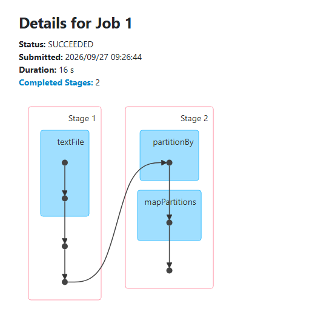

# Spark: MapReduce over the execution history (Exp 7)

PySpark jobs read the execution history PrediSched stores in PostgreSQL and compute, with explicit
map and reduce phases on the RDD API, the task count and mean execution time per task type and per
worker. A DataFrame job builds the aggregated features the ML pipeline trains on. The scheduler runs
the jobs as `MAPREDUCE_TASK`.

Built by `spec/prompts/12-spark-mapreduce.md`. Spec sections: §4 FR20, §11 Exp 7, §12.1, §7.2
(`MAPREDUCE_TASK`), §8.1.

## Layout

| Path | What |
| --- | --- |
| `spark/requirements.txt` | PySpark 3.5.3, pandas, pyarrow, psycopg, pytest (pinned) |
| `spark/export_history.py` | Dumps `execution_history` to `spark/data/execution_history.csv` and `events` to `spark/data/events.jsonl` with psycopg `COPY`; no Spark needed |
| `spark/predisched_spark/wordcount.py` | Warm-up: word count over event types and detail values |
| `spark/predisched_spark/exec_stats.py` | The Exp 7 job, RDD API only |
| `spark/predisched_spark/features.py` | DataFrame job: ML aggregates, written as Parquet to `ml/data/features/` |
| `spark/predisched_spark/common.py` | Arguments (`--input`, `--output`, `--hold-ui`), the SparkSession, small-result writers |
| `spark/predisched_spark/pyworker.py` | Windows-only Python worker entry (see "Windows") |
| `predisched-worker/.../MapReduceTaskExecutor.java` | `MAPREDUCE_TASK`: `spark-submit` as a subprocess |
| `docker/spark.Dockerfile`, `scripts/run-spark.ps1` / `.sh` | Run a job natively or in Docker, whichever is available |
| `configs/spark.yaml` | `configs/storage.yaml` plus a worker `spark:` section |

`spark/data/`, `spark/out/` and `ml/data/features/` are generated and ignored by git.

## Map and reduce phases (`exec_stats.py`)

```
textFile(csv)                         one line per execution
  filter    header, malformed, status != COMPLETED
  flatMap   row -> ("type:"+task_type, (exec_time_ms, 1)), ("worker:"+worker_id, (exec_time_ms, 1))
  reduceByKey  (t1, n1) + (t2, n2) = (t1 + t2, n1 + n2)          <- shuffle
  map       (key, (total, n)) -> (key, n, total / n, total)
collect                               13 rows: 10 task types + 3 workers
```

Both groupings go through a single shuffle: each key carries its grouping as a prefix, and the
driver splits the collected rows by it. Only completed executions count, because a failed attempt's
time says nothing about how long the task takes. The result is a few dozen rows, so jobs `collect`
it and write CSV/Parquet with Python instead of Spark's Hadoop writers. That removes the one part of
Spark that needs `winutils.exe` on Windows (see below).

The Spark UI (`--hold-ui 300` keeps it up after the job) shows exactly those two stages. Stage 1 is
`textFile` → the Python map side; Stage 2 starts at the shuffle (`partitionBy`) and runs the reduce
(`mapPartitions`):



`wordcount.py` follows the same pattern: `flatMap` from a JSON event to its words (the event type,
then each word of each detail value), `map` to `(word, 1)`, then `reduceByKey`.

## ML features (`features.py`)

DataFrame API over the same CSV (completed rows only):

- `type_worker.parquet`: per `(task_type, worker_id)`, `tasks`, `exec_mean_ms`, `exec_p50_ms`,
  `exec_p95_ms` (`percentile_approx`), and `exec_std_ms` (sample std, 0 for a single task).
- `worker_windows.parquet`: per worker over 10 s windows sliding every 5 s, `arrival_rate`
  (dispatches / 10 s), `queue_len_mean` and `queue_len_max` of the queue length seen at dispatch.

Prompt 16 trains on these.

## Running

```bash
python -m venv .venv
.venv/Scripts/python -m pip install -r spark/requirements.txt    # .venv/bin/python on Linux
python spark/export_history.py                                    # needs the PostgreSQL of storage.md
spark-submit --master local[*] spark/predisched_spark/exec_stats.py --input spark/data/execution_history.csv --output spark/out
spark-submit --master local[*] spark/predisched_spark/wordcount.py --input spark/data/events.jsonl --output spark/out
spark-submit --master local[*] spark/predisched_spark/features.py --input spark/data/execution_history.csv --output ml/data/features
```

`spark-submit` is in the venv (`.venv/Scripts/spark-submit.cmd`, `.venv/bin/spark-submit`) and needs
`JAVA_HOME` pointing to Java 17. Set `PYSPARK_PYTHON` to the venv's Python so the executors use the
same interpreter; the jobs set it themselves when started with plain `python`.

`scripts/run-spark.sh <job.py> [args]` (or `scripts/run-spark.ps1`) picks a native `spark-submit`
(`SPARK_HOME`, `PATH`, then the repo's `.venv`) and falls back to Docker:

```bash
docker build -f docker/spark.Dockerfile -t predisched-spark .
docker run --rm -v "$PWD:/work" predisched-spark exec_stats.py --input spark/data/execution_history.csv --output spark/out
```

The spec names the `apache/spark-py` image. That image stopped at v3.4.0 and continues as
`apache/spark:<version>-python3`, so the Dockerfile uses `apache/spark:3.5.3-python3` to match the
pinned PySpark.

### Windows

Three things differ from Linux:

1. **`winutils.exe` / `HADOOP_HOME`.** Spark's Hadoop file writers (`df.write`, `saveAsTextFile`)
   need `%HADOOP_HOME%\bin\winutils.exe` (and `hadoop.dll`) built for Hadoop 3.3. Without them,
   Spark logs `Did not find winutils.exe` and the writers fail. These jobs never use those writers
   (results go through the driver), so they run without it and the warning is harmless. For your own
   jobs that write with Spark: put a Hadoop 3.3 `winutils.exe` in `C:\hadoop\bin` and set
   `HADOOP_HOME=C:\hadoop` and `PATH=%PATH%;C:\hadoop\bin`. Alternatively use the Docker route above,
   which needs neither.
2. **Python worker flush.** Windows has no forking daemon, so Spark starts one `python -m
   pyspark.worker` per task. In PySpark 3.5.3 that entry point never flushes its socket after the
   task's final records and leaves it to interpreter shutdown. Under Python 3.12 the socket can close
   first. The worker exits 0, but the JVM reads EOF and fails the task with `Python worker exited
   unexpectedly (crashed)`, even for `parallelize(range(10)).map(...)`. `pyworker.py` is the same
   entry point with a `finally: flush()`. `common.configure` selects it on Windows with
   `spark.python.worker.module` and puts `spark/` on the executors' `PYTHONPATH`. It was found by
   running the worker through a shim: `main` returned normally, and one explicit flush made the job
   succeed.
3. **`distutils`.** PySpark 3.5's `toPandas` imports `distutils`, which Python 3.12 removed.
   `setuptools` (pinned in `requirements.txt`) provides it.

## MAPREDUCE_TASK

```
MAPREDUCE_TASK  dataset=<csv or jsonl path>, job=avg_exec|wordcount
```

The worker runs `<spark.home>/bin/spark-submit[.cmd] --master local[*] <jobsDir>/<exec_stats.py |
wordcount.py> --input <dataset> --output <outputDir>/<job>-<ms>-<n>`, with `PYSPARK_PYTHON` set to
`spark.python`. It kills the process after `spark.timeoutMs` or when the task is cancelled. The job
prints one machine-readable line, `ROWS by_type=10 by_worker=3 output=...`, and the task's result is
`job=<job>` plus that line. Any non-zero exit, or a run without a `ROWS` line, fails the task and
carries the last 20 lines of Spark output.

- Resource profile `PARALLEL`: `local[*]` takes every core.
- Not deterministic for the result cache: the answer depends on the file's current contents.
- With an empty `spark.home` (the default), the task type stays registered but every run fails with
  `MAPREDUCE_TASK is disabled on this worker: spark.home is not configured`. Input is validated
  first, so `job=sort` is still rejected at submit time.

```yaml
spark:                              # configs/spark.yaml
  home: ".venv/Lib/site-packages/pyspark"   # .venv/lib/python3.12/site-packages/pyspark on Linux
  python: ".venv/Scripts/python.exe"
  jobsDir: "spark/predisched_spark"
  outputDir: "spark/out/tasks"
  timeoutMs: 600000
```

## Real output

Measured on 2026-09-27 (Windows 11, 8 cores, Java 17, Python 3.12, PySpark 3.5.3) over the history
of the prompt 11 replays.

`python spark/export_history.py`:

```
exported 633 execution_history rows and 5527 events to C:\CODING\predisched\spark\data
```

`spark-submit --master local[*] spark/predisched_spark/exec_stats.py --input spark/data/execution_history.csv --output spark/out`
(42 s wall, most of it JVM and Python worker start-up):

```
Per task type
  task_type         tasks  mean_exec_ms  total_exec_ms
  COMPRESS_TASK     28     382.3         10704
  CPU_TASK          37     17.9          663
  FILE_IO_TASK      129    116.7         15052
  GRAPH_TASK        25     78.0          1950
  HASH_TASK         46     55.9          2573
  HTTP_TASK         144    158.7         22846
  MATRIX_TASK       44     29.4          1293
  MONTE_CARLO_TASK  36     224.1         8066
  SLEEP_TASK        102    393.1         40092
  SORT_TASK         42     86.8          3646
Per worker
  worker_id  tasks  mean_exec_ms  total_exec_ms
  worker-1   211    179.3         37841
  worker-2   211    162.4         34272
  worker-3   211    164.8         34772
ROWS by_type=10 by_worker=3 output=spark\out
```

Cross-check: a pandas `groupby().agg(["count", "mean"])` over the same CSV matches `by_type.csv`
and `by_worker.csv` on all 13 keys (counts exactly, means within 1e-9). The round-robin replays give
each worker exactly 211 tasks.

`wordcount.py` over `events.jsonl` (26 distinct words), top of the list:

```
  COMPLETED          1200
  SUBMIT             1200
  SLA_MET            1149
  DISPATCH           633
  ENQUEUE            633
  RESULT             633
  ...
  CACHE_HIT          567
```

`features.py` → `ml/data/features/`: `type_worker.parquet` 30 rows, `worker_windows.parquet` 120
rows, no nulls:

```
    task_type worker_id  tasks  exec_mean_ms  exec_p50_ms  exec_p95_ms  exec_std_ms
COMPRESS_TASK  worker-1     10         362.7        325.0        810.0        221.5
COMPRESS_TASK  worker-2     10         376.2        353.0        608.0        189.7
     CPU_TASK  worker-1     10          20.6         17.0         50.0         13.9

worker_id        window_start          window_end  arrival_rate  queue_len_mean  queue_len_max
 worker-1 2026-09-27 04:52:55 2026-09-27 04:53:05           2.0             0.0            0.0
 worker-1 2026-09-27 04:53:00 2026-09-27 04:53:10           2.1             0.0            0.0
```

Through the scheduler (scheduler and worker on `configs/spark.yaml`):

```
$ predisched submit --type MAPREDUCE_TASK --input "dataset=spark/data/execution_history.csv, job=avg_exec" --priority 5
accepted=true task_id=task-83d24d96 trace=696bb47e lamport=98 message='queued'
$ predisched submit --type MAPREDUCE_TASK --input "dataset=spark/data/events.jsonl, job=wordcount" --priority 5
accepted=true task_id=task-27319214 trace=36d2d873 lamport=127 message='queued'
$ predisched submit --type MAPREDUCE_TASK --input "dataset=x.csv, job=sort" --priority 5
accepted=false task_id=task-c1b80e25 trace=af3ec0f6 lamport=0 message='job must be one of [avg_exec, wordcount] (got 'sort')'

$ predisched status task-83d24d96
task_id=task-83d24d96 status=COMPLETED worker=worker-1 exec_ms=33444 trace=696bb47e attempts=1 result='job=avg_exec by_type=10 by_worker=3 output=spark\out\tasks\avg_exec-1790481696770-1'
$ predisched status task-27319214
task_id=task-27319214 status=COMPLETED worker=worker-1 exec_ms=29351 trace=36d2d873 attempts=1 result='job=wordcount wordcount=26 output=spark\out\tasks\wordcount-1790481700972-2'
```

## Tests

- `spark/tests/test_jobs.py` (`python -m pytest` in `spark/`; local[2] SparkSession fixture, UI
  off), over a 20-row fixture with one failed row:
  - `exec_stats` equals a pandas `groupby().mean()` and count, per type and per worker (spec §17
    Spark row).
  - The failed row is left out (19 counted).
  - `features` has the expected columns, no nulls, all three workers, and every dispatch counted in
    exactly two sliding windows.
  - `wordcount` counts event types and detail words.
  - Result: 4 passed on Windows.
- `MapReduceTaskExecutorTest`: the `spark-submit` command line for both jobs, profile and
  determinism; disabled without `spark.home`, with input validated first.
- `TaskInputSpecTest`: `MAPREDUCE_TASK` input rules.
- CI runs the Spark tests in a separate `spark` job (Python 3.11, Java 17).
