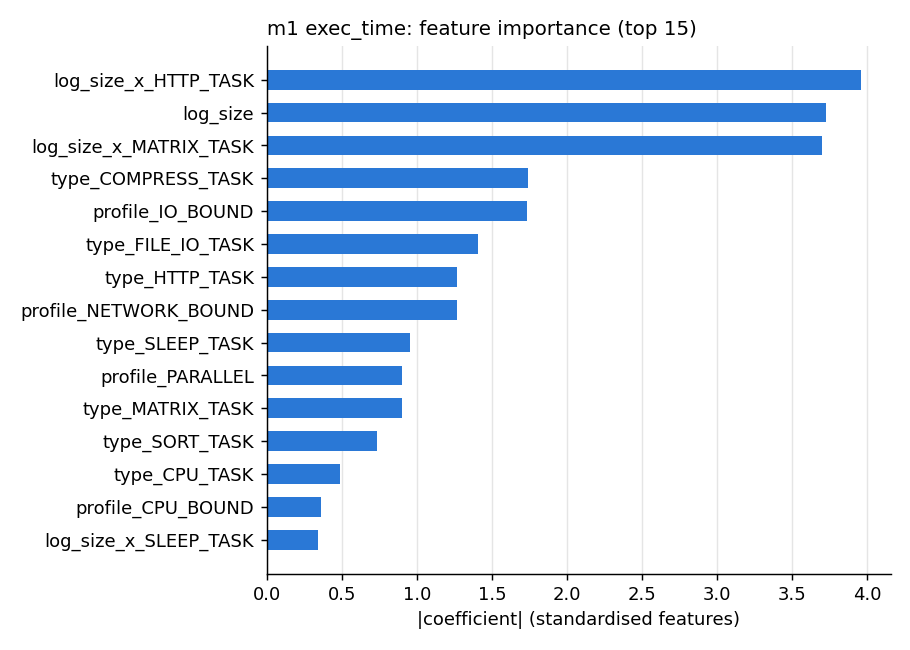

# m1: exec_time v1 (linear(alpha=0.1))

Kept because: linear(alpha=0.1) is the simplest candidate whose CV mae (26.0195) beats the best baseline (mean per task_type, 79.8627) by at least 10%; random forest scores better (17.9240) but is more complex, xgboost scores better (22.4533) but is more complex.

## Live model on each evaluation set

| set | N | MAE | RMSE | R2 |
| --- | --- | --- | --- | --- |
| time-split test | 1,494 | 28.016 | 96.637 | 0.847 |
| held-out pattern | 3,578 | 20.865 | 63.509 | 0.921 |
| held-out task type | 268 | 60.694 | 103.192 | 0.023 |

Cold start: 268 of 268 held-out-type rows (GRAPH_TASK) were flagged `cold_start` and predicted from the type's running mean (else the global mean).

## Per task type: time-split test

| task_type | rows | mean actual | MAE | RMSE |
| --- | --- | --- | --- | --- |
| COMPRESS_TASK | 71 | 378.1 | 94.771 | 236.390 |
| CPU_TASK | 249 | 5.6 | 1.764 | 3.550 |
| FILE_IO_TASK | 145 | 47.3 | 14.732 | 20.049 |
| HASH_TASK | 56 | 16.9 | 4.630 | 8.115 |
| HTTP_TASK | 155 | 201.0 | 23.124 | 31.874 |
| MATRIX_TASK | 248 | 57.1 | 21.505 | 61.741 |
| MONTE_CARLO_TASK | 63 | 79.8 | 8.473 | 12.002 |
| SLEEP_TASK | 288 | 396.5 | 30.597 | 50.038 |
| SORT_TASK | 219 | 66.2 | 64.063 | 192.156 |

## Per task type: held-out pattern

| task_type | rows | mean actual | MAE | RMSE |
| --- | --- | --- | --- | --- |
| COMPRESS_TASK | 180 | 398.4 | 79.949 | 165.170 |
| CPU_TASK | 784 | 6.2 | 2.076 | 3.626 |
| FILE_IO_TASK | 316 | 34.6 | 12.041 | 19.230 |
| HASH_TASK | 316 | 19.1 | 5.004 | 7.373 |
| HTTP_TASK | 263 | 224.6 | 18.749 | 26.645 |
| MATRIX_TASK | 536 | 47.7 | 10.127 | 23.707 |
| MONTE_CARLO_TASK | 248 | 85.4 | 13.338 | 18.733 |
| SLEEP_TASK | 564 | 385.9 | 32.717 | 50.231 |
| SORT_TASK | 371 | 57.2 | 56.955 | 141.024 |

## Per task type: held-out task type

| task_type | rows | mean actual | MAE | RMSE |
| --- | --- | --- | --- | --- |
| GRAPH_TASK | 268 | 73.9 | 60.694 | 103.192 |

## Candidates (from training)

### time-split test

| candidate | MAE | RMSE | R2 |
| --- | --- | --- | --- |
| mean per task_type | 92.736 | 197.654 | 0.358 |
| **linear(alpha=0.1)** (kept) | 28.016 | 96.637 | 0.847 |
| random forest(max_depth=16, min_samples_leaf=1, n_estimators=200) | 15.691 | 57.151 | 0.946 |
| xgboost(learning_rate=0.05, max_depth=6, n_estimators=300) | 20.439 | 61.116 | 0.939 |
| linear(alpha=0.1) + cold-start fallback | 28.016 | 96.637 | 0.847 |

### held-out pattern

| candidate | MAE | RMSE | R2 |
| --- | --- | --- | --- |
| mean per task_type | 83.731 | 174.573 | 0.406 |
| **linear(alpha=0.1)** (kept) | 20.865 | 63.509 | 0.921 |
| random forest(max_depth=16, min_samples_leaf=1, n_estimators=200) | 19.294 | 80.904 | 0.873 |
| xgboost(learning_rate=0.05, max_depth=6, n_estimators=300) | 20.533 | 69.968 | 0.905 |
| linear(alpha=0.1) + cold-start fallback | 20.865 | 63.509 | 0.921 |

### held-out task type

| candidate | MAE | RMSE | R2 |
| --- | --- | --- | --- |
| mean per task_type | 95.128 | 115.522 | -0.225 |
| **linear(alpha=0.1)** (kept) | 37.151 | 78.660 | 0.432 |
| random forest(max_depth=16, min_samples_leaf=1, n_estimators=200) | 64.924 | 121.043 | -0.345 |
| xgboost(learning_rate=0.05, max_depth=6, n_estimators=300) | 64.506 | 120.369 | -0.330 |
| linear(alpha=0.1) + cold-start fallback [268 cold-start rows] | 60.694 | 103.192 | 0.023 |

## Plots

