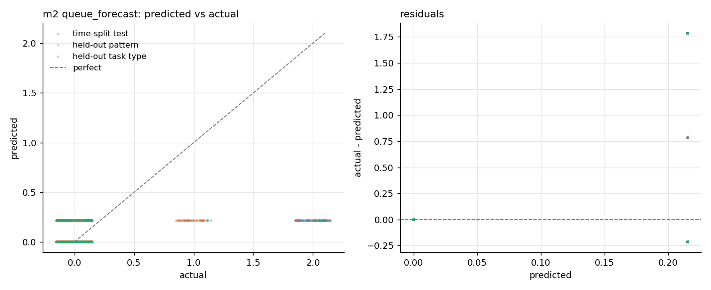

# m2: queue_forecast v1 (mean per worker_id)

Kept because: no candidate beat the best baseline (mean per worker_id, CV mae 0.1017) by 10%: the baseline is kept.

## Live model on each evaluation set

| set | N | MAE | RMSE | R2 |
| --- | --- | --- | --- | --- |
| time-split test | 1,494 | 0.149 | 0.450 | 0.118 |
| held-out pattern | 3,578 | 0.078 | 0.194 | -0.109 |
| held-out task type | 268 | 0.158 | 0.412 | 0.104 |

## Per task type: time-split test

| task_type | rows | mean actual | MAE | RMSE |
| --- | --- | --- | --- | --- |
| COMPRESS_TASK | 71 | 0.1 | 0.177 | 0.485 |
| CPU_TASK | 249 | 0.2 | 0.168 | 0.492 |
| FILE_IO_TASK | 145 | 0.1 | 0.130 | 0.383 |
| HASH_TASK | 56 | 0.0 | 0.056 | 0.142 |
| HTTP_TASK | 155 | 0.0 | 0.069 | 0.263 |
| MATRIX_TASK | 248 | 0.1 | 0.084 | 0.315 |
| MONTE_CARLO_TASK | 63 | 0.0 | 0.050 | 0.134 |
| SLEEP_TASK | 288 | 0.3 | 0.309 | 0.697 |
| SORT_TASK | 219 | 0.1 | 0.104 | 0.353 |

## Per task type: held-out pattern

| task_type | rows | mean actual | MAE | RMSE |
| --- | --- | --- | --- | --- |
| COMPRESS_TASK | 180 | 0.1 | 0.090 | 0.276 |
| CPU_TASK | 784 | 0.0 | 0.072 | 0.143 |
| FILE_IO_TASK | 316 | 0.0 | 0.061 | 0.142 |
| HASH_TASK | 316 | 0.0 | 0.099 | 0.253 |
| HTTP_TASK | 263 | 0.0 | 0.081 | 0.209 |
| MATRIX_TASK | 536 | 0.0 | 0.075 | 0.192 |
| MONTE_CARLO_TASK | 248 | 0.0 | 0.072 | 0.157 |
| SLEEP_TASK | 564 | 0.0 | 0.075 | 0.180 |
| SORT_TASK | 371 | 0.0 | 0.091 | 0.244 |

## Per task type: held-out task type

| task_type | rows | mean actual | MAE | RMSE |
| --- | --- | --- | --- | --- |
| GRAPH_TASK | 268 | 0.1 | 0.158 | 0.412 |

## Candidates (from training)

### time-split test

| candidate | MAE | RMSE | R2 |
| --- | --- | --- | --- |
| persistence (queue_len now) | 0.187 | 0.607 | -0.601 |
| **mean per worker_id** (kept) | 0.149 | 0.450 | 0.118 |
| linear(alpha=10.0) | 0.183 | 0.415 | 0.252 |
| random forest(max_depth=16, min_samples_leaf=5, n_estimators=200) | 0.167 | 0.434 | 0.179 |
| xgboost(learning_rate=0.1, max_depth=6, n_estimators=300) | 0.219 | 0.534 | -0.238 |

### held-out pattern

| candidate | MAE | RMSE | R2 |
| --- | --- | --- | --- |
| persistence (queue_len now) | 0.054 | 0.281 | -1.331 |
| **mean per worker_id** (kept) | 0.078 | 0.194 | -0.109 |
| linear(alpha=10.0) | 0.079 | 0.200 | -0.178 |
| random forest(max_depth=16, min_samples_leaf=5, n_estimators=200) | 0.120 | 0.330 | -2.213 |
| xgboost(learning_rate=0.1, max_depth=6, n_estimators=300) | 0.126 | 0.348 | -2.587 |

### held-out task type

| candidate | MAE | RMSE | R2 |
| --- | --- | --- | --- |
| persistence (queue_len now) | 0.112 | 0.432 | 0.013 |
| **mean per worker_id** (kept) | 0.158 | 0.412 | 0.104 |
| linear(alpha=10.0) | 0.115 | 0.409 | 0.116 |
| random forest(max_depth=16, min_samples_leaf=5, n_estimators=200) | 0.112 | 0.363 | 0.302 |
| xgboost(learning_rate=0.1, max_depth=6, n_estimators=300) | 0.089 | 0.327 | 0.433 |

## Plots

