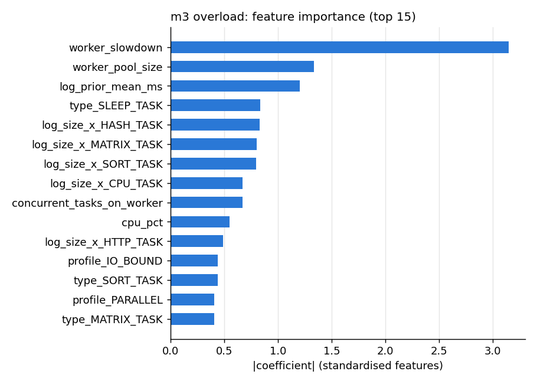

# m3: overload v1 (linear(C=1.0))

Kept because: linear(C=1.0) is the simplest candidate whose CV f1 (0.5679) beats the best baseline (rate per worker_id, 0.4875) by at least 10%; xgboost scores better (0.5721) but is more complex.

## Live model on each evaluation set

| set | N | POSITIVES | PRECISION | RECALL | F1 | ROC-AUC |
| --- | --- | --- | --- | --- | --- | --- |
| time-split test | 1,494 | 196 | 0.866 | 0.923 | 0.894 | 0.990 |
| held-out pattern | 3,578 | 129 | 0.180 | 0.357 | 0.240 | 0.903 |
| held-out task type | 268 | 28 | 0.583 | 0.250 | 0.350 | 0.877 |

## Per task type: time-split test

| task_type | rows | positives | precision | recall | F1 |
| --- | --- | --- | --- | --- | --- |
| COMPRESS_TASK | 71 | 12 | 0.889 | 0.667 | 0.762 |
| CPU_TASK | 249 | 32 | 0.780 | 1.000 | 0.877 |
| FILE_IO_TASK | 145 | 28 | 0.857 | 0.857 | 0.857 |
| HASH_TASK | 56 | 0 | 0.000 | 0.000 | 0.000 |
| HTTP_TASK | 155 | 14 | 0.778 | 1.000 | 0.875 |
| MATRIX_TASK | 248 | 12 | 1.000 | 0.833 | 0.909 |
| MONTE_CARLO_TASK | 63 | 0 | 0.000 | 0.000 | 0.000 |
| SLEEP_TASK | 288 | 80 | 0.897 | 0.975 | 0.934 |
| SORT_TASK | 219 | 18 | 0.938 | 0.833 | 0.882 |

## Per task type: held-out pattern

| task_type | rows | positives | precision | recall | F1 |
| --- | --- | --- | --- | --- | --- |
| COMPRESS_TASK | 180 | 8 | 0.200 | 0.250 | 0.222 |
| CPU_TASK | 784 | 21 | 0.192 | 0.476 | 0.274 |
| FILE_IO_TASK | 316 | 7 | 0.154 | 0.286 | 0.200 |
| HASH_TASK | 316 | 17 | 0.600 | 0.353 | 0.444 |
| HTTP_TASK | 263 | 18 | 0.259 | 0.389 | 0.311 |
| MATRIX_TASK | 536 | 15 | 0.067 | 0.133 | 0.089 |
| MONTE_CARLO_TASK | 248 | 13 | 1.000 | 0.231 | 0.375 |
| SLEEP_TASK | 564 | 14 | 0.088 | 0.571 | 0.152 |
| SORT_TASK | 371 | 16 | 0.316 | 0.375 | 0.343 |

## Per task type: held-out task type

| task_type | rows | positives | precision | recall | F1 |
| --- | --- | --- | --- | --- | --- |
| GRAPH_TASK | 268 | 28 | 0.583 | 0.250 | 0.350 |

## Candidates (from training)

### time-split test

| candidate | PRECISION | RECALL | F1 | ROC-AUC |
| --- | --- | --- | --- | --- |
| majority class | 0.000 | 0.000 | 0.000 | 0.500 |
| rate per worker_id | 0.544 | 1.000 | 0.705 | 0.937 |
| **linear(C=1.0)** (kept) | 0.866 | 0.923 | 0.894 | 0.990 |
| random forest(max_depth=16, min_samples_leaf=5, n_estimators=200) | 0.614 | 1.000 | 0.761 | 0.992 |
| xgboost(learning_rate=0.05, max_depth=6, n_estimators=300) | 0.698 | 1.000 | 0.822 | 0.983 |

### held-out pattern

| candidate | PRECISION | RECALL | F1 | ROC-AUC |
| --- | --- | --- | --- | --- |
| majority class | 0.000 | 0.000 | 0.000 | 0.500 |
| rate per worker_id | 0.125 | 1.000 | 0.223 | 0.869 |
| **linear(C=1.0)** (kept) | 0.180 | 0.357 | 0.240 | 0.903 |
| random forest(max_depth=16, min_samples_leaf=5, n_estimators=200) | 0.169 | 0.837 | 0.281 | 0.909 |
| xgboost(learning_rate=0.05, max_depth=6, n_estimators=300) | 0.150 | 0.767 | 0.251 | 0.899 |

### held-out task type

| candidate | PRECISION | RECALL | F1 | ROC-AUC |
| --- | --- | --- | --- | --- |
| majority class | 0.000 | 0.000 | 0.000 | 0.500 |
| rate per worker_id | 0.301 | 1.000 | 0.463 | 0.865 |
| **linear(C=1.0)** (kept) | 0.583 | 0.250 | 0.350 | 0.877 |
| random forest(max_depth=16, min_samples_leaf=5, n_estimators=200) | 0.489 | 0.786 | 0.603 | 0.942 |
| xgboost(learning_rate=0.05, max_depth=6, n_estimators=300) | 0.513 | 0.714 | 0.597 | 0.937 |

## Plots

